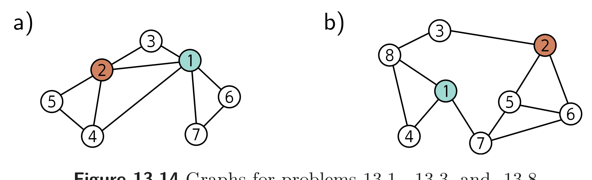
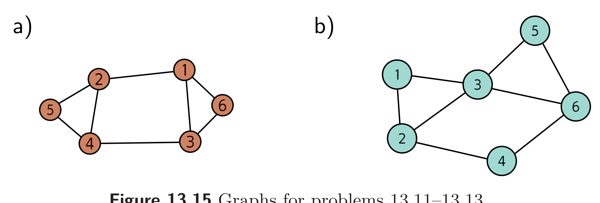

  

  <strong>Figure 13.14</strong> Graphs for problems 13.1, 13.3, and 13.8.

  

  <strong>Figure 13.15</strong> Graphs for problems 13.11–13.13.

$$
\begin{aligned}
\mathbf{H}_{k+1}
&= \mathrm{GraphLayer}[\mathbf{H}_{k},\mathbf{A}] \\
&= \mathbf{a}\left[\boldsymbol{\beta}_{k}\mathbf{1}^{T}+\boldsymbol{\Omega}_{k}\begin{bmatrix}\mathbf{H}_{k}\\ \mathbf{H}_{k}\mathbf{A}\end{bmatrix}\right]
\end{aligned}
\qquad (13.28)
$$

where H is a $D \times N$ matrix containing the $N$ node embeddings in its columns, $\mathbf{A}$ is the $N \times N$ adjacency matrix, $\boldsymbol{\beta}$ is the bias vector, and $\Omega$ is the weight matrix. Show that this layer is equivariant to permutations of the node order so that:

$$
\mathrm{GraphLayer}[\mathbf{H}_{k},\mathbf{A}]\mathbf{P}
= \mathrm{GraphLayer}[\mathbf{H}_{k}\mathbf{P},\mathbf{P}^{T}\mathbf{A}\mathbf{P}]
\qquad (13.29)
$$

where P is an $N \times N$ permutation matrix.

Problem 13.8 What is the degree matrix $\mathbf{D}$ for each graph in figure 13.14?

Problem 13.9 The authors of GraphSAGE (Hamilton et al., 2017a) propose a pooling method in which the node embedding is averaged together with its neighbors so that:

$$
\mathrm{agg}[n]
= \frac{1}{1+|\mathrm{ne}[n]|}\left(\mathbf{h}_{n}+\sum_{m\in\mathrm{ne}[n]}\mathbf{h}_{m}\right)
\qquad (13.30)
$$

Show how this operation can be computed simultaneously for all node embeddings in the $D \times N$ embedding matrix $\mathbf{H}$ using linear algebra. You will need to use both the adjacency matrix $\mathbf{A}$ and the degree matrix $\mathbf{D}$.

Problem 13.10* Devise a graph attention mechanism based on dot-product self-attention and draw its mechanism in the style of figure 13.12.

Problem 13.11* Draw the edge graph associated with the graph in figure 13.15a.
