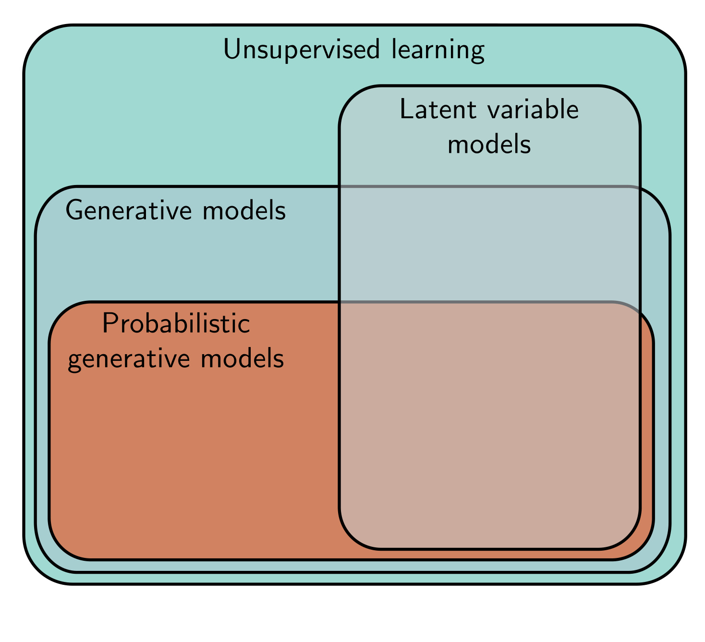

  

  <strong>Figure 14.1</strong> Taxonomy of unsupervised learning models. Unsupervised learning refers to any model trained on datasets without labels. Generative models can synthesize (generate) new examples with similar statistics to the training data. A subset of these are probabilistic and define a distribution over the data. We draw samples from this distribution to generate new examples. Latent variable models define a mapping between an underlying explanatory (latent) variable and the data and may fall into any of the above categories.

famous k-means algorithm maps the data x to a cluster assignment $z \in \lbrace 1, 2, ..., K \rbrace$. Other models map from the latent variables z to the data x. Consider defining a distribution $Pr(\mathbf{z})$ over the latent variable $\mathbf{z}$ in these models. New examples can now be generated by (i) drawing from this distribution and (ii) mapping the sample to the data space $\mathbf{x}$. Accordingly, these are termed generative models (see figure 14.1).
The four models in chapters 15 to 18 are all generative models that use latent variables. Generative adversarial networks (chapter 15) learn to generate data examples $\mathbf{x}^{*}$ from latent variables z, using a loss that encourages the generated samples to be indistinguishable from real examples (figure 14.2a).

from latent variables z. Using a loss that encourages the generated samples to be indistinguishable from real examples (figure 14.2a).

Normalizing flows, variational autoencoders, and diffusion models (chapters 16–18)

are probabilistic generative models. In addition to generating new examples, they assign a

probability  $Pr(\mathbf{x}|\phi)$  to each data point x. This will depend on the model parameters  $\phi$ ,

and in training, we maximize the probability of the observed data  $\lbrace x_{i} \rbrace$ , so the loss is

and in training, we maximize the probability of the observed data

the sum of the negative log-likelihoods (figure 14.2b):

$$
\begin{aligned}
L[\phi]=-\sum_{i=1}^{I}\log\left[Pr(\mathbf{x}_{i}|\phi)\right].
\tag{14.1}
\end{aligned}
$$

Since probability distributions must sum to one, this implicitly reduces the probability of examples that lie far from the observed data. As well as providing a training criterion, assigning probabilities is useful in its own right; the probability on a test set can be used to compare two models quantitatively, and the probability for an example can be thresholded to determine if it belongs to the same dataset or is an outlier. [^2]

## 14.2 What makes a good generative model?

Generative models based on latent variables should have the following properties:

[^2]: Note that not all probabilistic generative models rely on latent variables. The transformer decoder (section 12.7) was learned without labels, can generate new examples, and can assign a probability to these examples but is based on an autoregressive formulation (equation 12.15).
