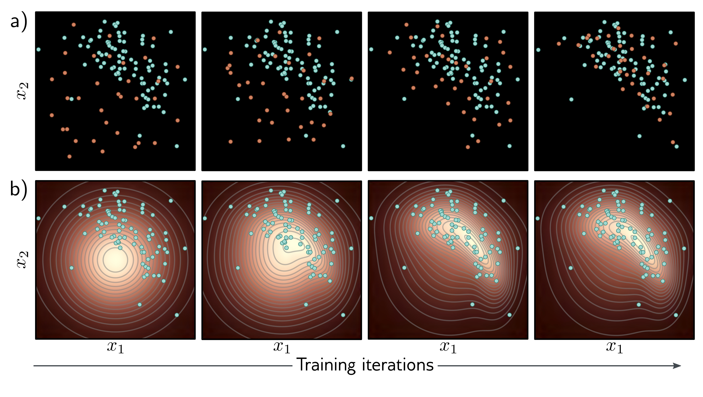

  

  <strong>Figure 14.2</strong> Fitting generative models a) Generative adversarial models provide a mechanism for generating samples (orange points). As training proceeds (left to right), the loss function encourages these samples to become progressively less distinguishable from real examples (cyan points). b) Probabilistic models (including variational autoencoders, normalizing flows, and diffusion models) learn a probability distribution over the training data. As training proceeds (left to right), the likelihood of the real examples increases under this distribution, which can be used to draw new samples and assess the probability of new data points.

- Efficient sampling: Generating samples from the model should be computationally inexpensive and take advantage of the parallelism of modern hardware.

- High-quality sampling: The samples should be indistinguishable from the real data with which the model was trained.

- Coverage: Samples should represent the entire training distribution. It is insufficient to generate samples that all look like a subset of the training examples.

- Efficient likelihood computation: If the model is probabilistic, we would like to be able to calculate the probability of new examples efficiently and accurately.

- Disentangled latent space: Manipulating each dimension of z should correspond to changing an interpretable property of the data. For example, in a model of language, it might change the topic, tense, or verbosity.

- Efficient likelihood computation: If the model is probabilistic, we would like to be able to calculate the probability of new examples efficiently and accurately.

This naturally leads to the question of whether the generative models that we consider satisfy these properties. The answer is subjective, but figure 14.3 provides guidance. The precise assignments are disputable, but most practitioners would agree that there is no single model that satisfies all of these characteristics.
