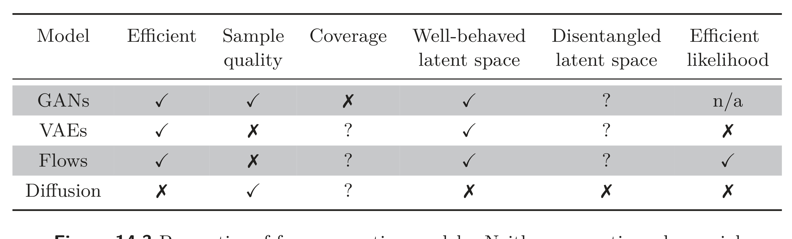

<table><tr><td>Model</td><td>Efficient</td><td>Sample quality</td><td>Coverage</td><td>Well-behaved latent space</td><td>Disentangled latent space</td><td>Efficient likelihood</td></tr><tr><td colspan="7">GANs</td></tr><tr><td>VAEs</td><td>✓</td><td>✗</td><td>?</td><td>✓</td><td>?</td><td>n/a</td></tr><tr><td>Diffusion</td><td>✗</td><td>✓</td><td>?</td><td>✗</td><td>?</td><td>✗</td></tr></table>

  

  <strong>Figure 14.3</strong> Properties of four generative models. Neither generative adversarial networks (GANs), variational autoencoders (VAEs), normalizing flows (Flows), nor diffusion models (diffusion) have the full complement of desirable properties.

## 14.3 Quantifying performance

The previous section discussed the desirable properties of generative models. We now consider quantitative measures of success for generative models. Much experimentation with generative models has used images due to the widespread availability of that data and the ease of qualitatively judging the samples. Consequently, some of these metrics only apply to images.

Test likelihood: One way to compare probabilistic models is to measure their likelihood for a test dataset. It is ineffective to measure the training data likelihood because a model could assign a very high probability to each training point and very low probabilities in between. This model would have a very high training likelihood but could only reproduce the training data. The test likelihood captures how well the model generalizes from the training data and also the coverage; if the model assigns a high probability to just a subset of the training data, it must assign lower probabilities elsewhere, so a portion of the test examples will have low probability.

Test likelihood is a sensible way to quantify probabilistic models, but unfortunately, it is not relevant for generative adversarial models (which do not assign a probability) and is expensive to estimate for variational autoencoders and diffusion models (although it is possible to compute a lower bound on the log-likelihood). Normalizing flows are the only type of model for which the likelihood can be computed exactly and efficiently.

Inception score: The inception score (IS) is specialized for images and ideally for generative models trained on the ImageNet database. The score is calculated using a pre-trained classification model – usually the “Inception” model, from which the name is derived. It is based on two criteria. First, each generated image  $x^{*}$  should look like one and only one of the 1000 possible classes y in the ImageNet database. Hence, the probability distribution  $\Pr[y \mid x\_{i}^{*}]$  should be highly peaked at the correct class. Second, the entire set of generated images should be assigned to the classes with equal probability, so  $\Pr[y]$  should be flat when averaged over all generated examples.
