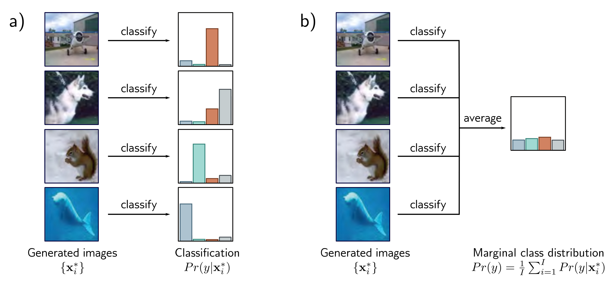

  

  <strong>Figure 14.4</strong> Inception score. a) A pretrained network classifies the generated images. If the images are realistic, the resulting class probabilities  $\Pr[y \mid x\_{i}^{*}]$  should be peaked at the correct class. b) If the model generates all classes equally frequently, the marginal (average) class probabilities should be flat. The inception score measures the average distance between the distributions in (a) and the distribution in (b). Images from Deng et al. (2009).

The inception score measures the average distance between these two distributions over the generated set. This distance will be large if one is peaked and the other flat (figure 14.4). More precisely, it returns the exponential of the expected KL-divergence between  $\Pr[y \mid \mathbf{x}\_{i}^{*}]$  and  $\Pr[y]$ :

$$
\mathrm{IS}
= \exp\left[\frac{1}{I}\sum_{i=1}^{I}D_{KL}\left[\Pr[y\mid\mathbf{x}_{i}^{*}]\Vert\Pr[y]\right]\right]
\qquad (14.2)
$$

where $I$ is the number of generated examples and:

$$
\Pr[y]
= \frac{1}{I}\sum_{i=1}^{I}\Pr[y\mid\mathbf{x}_{i}^{*}]
\qquad (14.3)
$$

This metric is only sensible for generative models of the ImageNet database and is sensitive to the particular classification model; retraining this model can give quite different numerical results. Moreover, it does not reward diversity within an object class; it returns a high value if the model only generates one realistic example of each class.

Fréchet inception distance: This measure is also intended for images and computes a symmetric distance between the distributions of generated samples and real examples. This must be approximate since it is hard to characterize either distribution (indeed,
