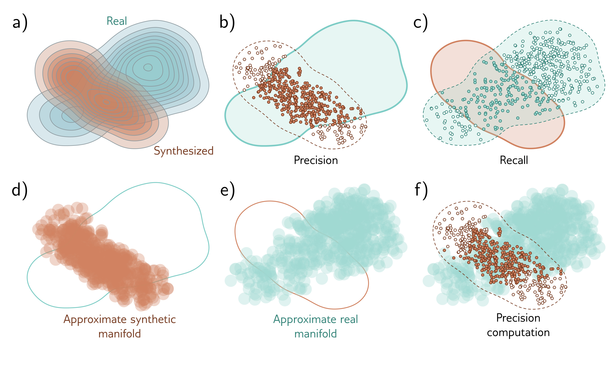

  

  <strong>Figure 14.5</strong> Manifold precision/recall. a) True distributions of real examples and samples synthesized by the generative model. b) The overlap can be summarized by the precision (the proportion of synthesized samples that overlap with the distribution or manifold of real examples), and c) recall (the proportion of real examples that overlap with the distribution or manifold of synthesized samples). d) The set of hyperspheres centered on each sample. Here, these have constant radius, but more commonly, the radius is based on the distance to the  $k^{th}$  nearest neighbor. e) The manifold for real examples is approximated similarly. f) The precision can be computed as the proportion of samples that lie within the approximated manifold of real examples. Similarly, the recall is computed as the proportion of real examples that lie within the approximated manifold of samples (not shown). Adapted from Kynkäänniemi et al. (2019).

(2015), diffusion models (Sohl-Dickstein et al., 2015; Ho et al., 2020), autoregressive models (Bengio et al., 2000; Van den Oord et al., 2016b), and energy-based models (LeCun et al., 2006). All except energy models are discussed in this book. Bond-Taylor et al. (2022) provide a recent survey of generative models.

Evaluation: Salimans et al. (2016) introduced the inception score, and Heusel et al. (2017) introduced the Fréchet inception distance, both of which are based on the Pool-3 layer of the Inception V3 model (Szegedy et al., 2016). Nash et al. (2021) used earlier layers of the same network that retain more spatial information to ensure that the spatial statistics of images are also replicated. Kynkäänniemi et al. (2019) introduced the manifold precision/recall method. Barratt & Sharma (2018) discuss the inception score in detail and point out its weaknesses. Borji (2022) discusses the pros and cons of different methods for assessing generative models.
