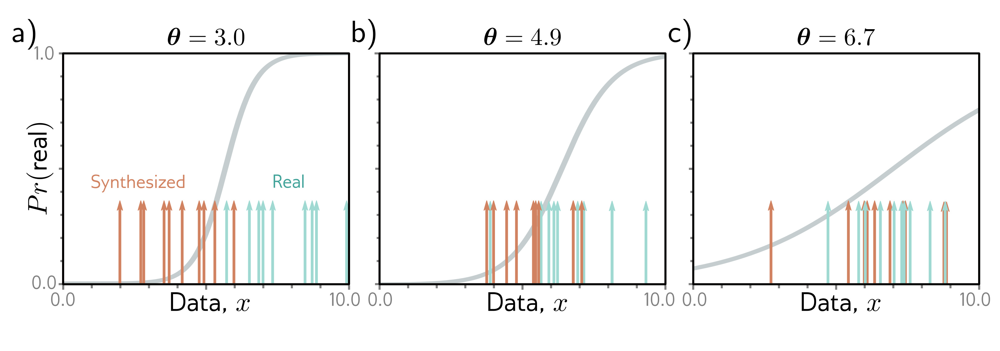

  

  <strong>Figure 15.1</strong> GAN mechanism. a) Given a parameterized function (a generator) that synthesizes samples (orange arrows) and a batch of real examples (cyan arrows), we train a discriminator to distinguish the real examples from the generated samples (sigmoid curve indicates the estimated probability that the data point is real). b) The generator is trained by modifying its parameters so that the discriminator becomes less confident the samples were synthetic (in this case, by moving the orange samples to the right). The discriminator is then updated. c) Alternating updates to the generator and discriminator cause the generated samples to become indistinguishable from real examples and the impetus to change the generator (i.e., the slope of the sigmoid function) to diminish.

proves impossible, the generated samples are indistinguishable from the real examples, and we have succeeded. If it is possible, the discriminator provides a signal that can be used to improve the generation process.

Figure 15.1 illustrates this scheme. We start with a training set $\lbrace x\_{i}\rbrace$ of real 1D examples. A different batch of ten of these examples $\lbrace x\_{i}\rbrace\_{i=1}^{10}$ is shown in each panel (cyan arrows). To create a batch of samples $\lbrace x\_{j}^{*}\rbrace$, we use the simple generator:

$$
x_{j}^{*}
= g[z_{j},\theta]
= z_{j}+\theta
\qquad (15.1)
$$

where latent variables $\lbrace z\_{j}\rbrace$ are drawn from a standard normal distribution, and the parameter $\theta$ translates the generated samples along the x-axis (figure 15.1).

At initialization, $\theta = 3.0$, and the generated samples (orange arrows) lie to the left of the real examples (cyan arrows). The discriminator is trained to distinguish the generated samples from the real examples (the sigmoid curve indicates the probability that a data point is real). During training, the generator parameters $\theta$ are manipulated to increase the probability that its samples are classified as real. Here, this means increasing $\theta$ so that the samples move rightwards where the sigmoid curve is higher.

We alternate between updating the discriminator and the generator. Figures 15.1b–c show two iterations of this process. It gradually becomes harder to classify the data, so the impetus to change  $\theta$  becomes weaker (i.e., the sigmoid becomes flatter). At the end of the process, there is no way to distinguish the two sets of data; the discriminator, which now has chance performance, is discarded, and we are left with a generator that makes plausible samples.
