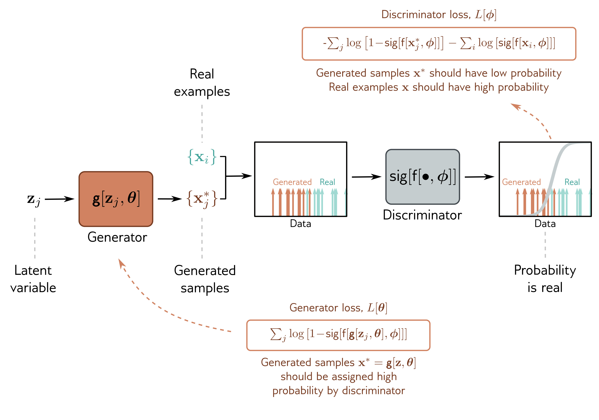

  

  <strong>Figure 15.2</strong> GAN loss functions. A latent variable $\mathbf{z}_{j}$ is drawn from the base distribution and passed through the generator to create a sample $\mathbf{x}^{*}$. A batch $\lbrace x_{j}^{*}\rbrace$ of samples and a batch of real examples $\lbrace \mathbf{x}_{i}\rbrace$ are passed to the discriminator, which assigns a probability that each is real. The discriminator parameters $\phi$ are modified to assign high probability to the real examples and low probability to the generated samples. The generator parameters $\theta$ are modified to “fool” the discriminator into assigning the generated samples a high probability.

where we multiplied the second function by minus one to convert to a minimization problem and dropped the second term, which has no dependence on  $\theta$ . Minimizing the first loss function trains the discriminator. Minimizing the second trainsthe generator.

At each step, we draw a batch of latent variables  $z_{j}$  from the base distribution and pass these through the generator to create samples  $x_{j}^{*} = g[z_{j}, \theta]$ . Then we choose a batch of real training examples  $x_{i}$ . Given the two batches, we can now perform one or more gradient descent steps on each loss function (figure 15.2).

## 15.1.3 Deep convolutional GAN

The deep convolutional GAN or DCGAN was an early GAN architecture specialized for generating images (figure 15.3). The input to the generator g[z, $\theta$ ] is a 100D latent
