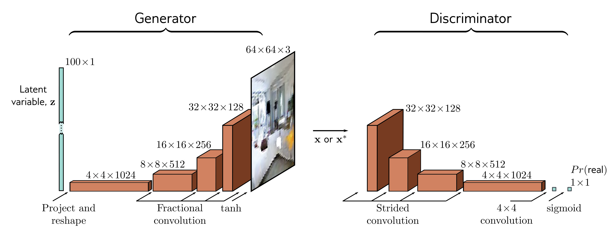

  

  <strong>Figure 15.3</strong> DCGAN architecture. In the generator, a 100D latent variable z is drawn from a uniform distribution and mapped by a linear transformation to a  $4 \times 4$  representation with 1024 channels. This is then passed through a series of convolutional layers that gradually upsample the representation and decrease the number of channels. At the end is a tanh function that maps the  $64 \times 64 \times 3$  representation to a fixed range so that it can represent an image. The discriminator consists of a standard convolutional net that classifies the input as either a real example or a generated sample.

variable z sampled from a uniform distribution. This is then mapped to a  $4 \times 4$  spatial representation with 1024 channels using a linear transformation. Four convolutional layers follow, each of which uses a fractionally-strided convolution that doubles the resolution (i.e., a convolution with a stride of 0.5). At the final layer, the  $64 \times 64 \times 3$  signal is passed through a tanh function to generate an image  $x^{*}$  in the range [-1, 1]. The discriminator f[•, φ] is a standard convolutional network where the final convolutional layer reduces the size to  $1 \times 1$  with one channel. This single number is passed through a sigmoid function sig[•] to create the output probability.

After training, the discriminator is discarded. To create new samples, latent variables z are drawn from the base distribution and passed through the generator. Example results are shown in figure 15.4.

## 15.1.4 Difficulty training GANs

Theoretically, the GAN is fairly straightforward. However, GANs are notoriously difficult to train. For example, to get the DCGAN to train reliably, it was necessary to (i) use strided convolutions for upsampling and downsampling; (ii) use BatchNorm in both generator and discriminator except in the last and first layers, respectively; (iii) use the leaky ReLU activation function (figure 3.13) in the discriminator; and (iv) use the Adam optimizer but with a lower momentum coefficient than usual. This is unusual. Most deep learning models are relatively robust to such choices.
