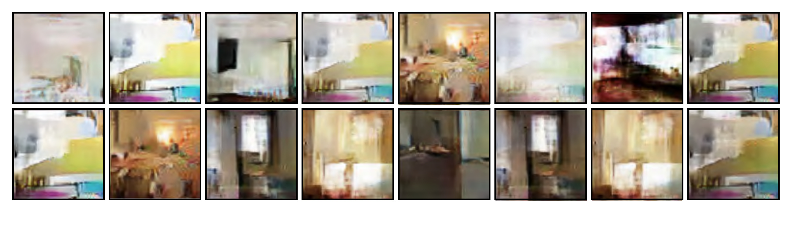

a)

  

  <strong>Figure 15.4</strong> Synthesized images from the DCGAN model.

b)

  

  <strong>Figure 15.4</strong> Synthesized images from the DCGAN model.

c)

A common failure mode is that the generator makes plausible samples, but these only represent a subset of the data (e.g., for faces, it might never generate faces with beards). This is known as mode dropping. An extreme version of this phenomenon can occur where the generator entirely or mostly ignores the latent variables z and collapses all samples to one or a few points; this is known as mode collapse (figure 15.5).

## 15.2 Improving stability

To understand why GANs are difficult to train, it’s necessary to understand exactly what the loss function represents.
