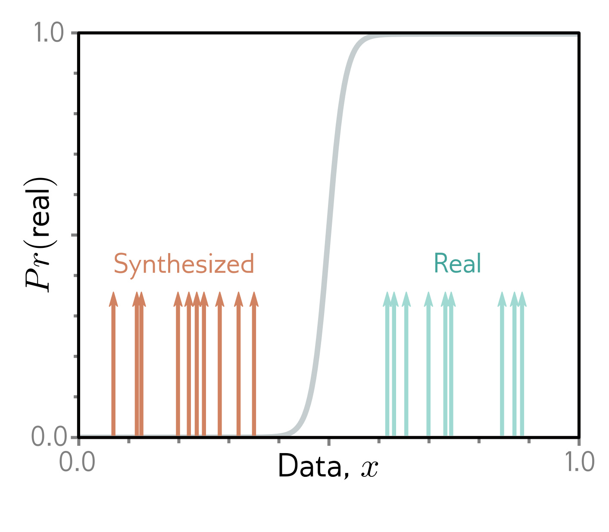

  

  <strong>Figure 15.6</strong> Problem with GAN loss function. If the generated samples (orange arrows) are easy to distinguish from the real examples (cyan arrows), then the discriminator (sigmoid) may have a very shallow slope at the positions of the samples; hence, the gradient to update the parameter of the generator may be tiny.

is high, the mixture  $(\Pr[\mathbf{x}^{*}] + \Pr[\mathbf{x}])/2$  has high probability. In other words, it penalizes regions with real examples but no samples. It enforces coverage. Referring to equation 15.6, we see that the second term does not depend on the generator, which consequently doesn’t care about coverage; it is happy to generate a subset of possible examples accurately. This is the putative reason for mode dropping.

## 15.2.2 Vanishing gradients

In the previous section, we saw that when the discriminator is optimal, the loss function maximizes a measure of the distance between the generated and real samples. However, there is a potential problem with using this distance between probability distributions as the criterion for optimizing GANs. If the probability distributions are completely disjoint, this distance is maximal, and any small change to the generator will not decrease the loss. The same phenomenon can be seen when we consider the original formulation; if the discriminator can perfectly separate the generated and real samples, no small change to the generated data will change the classification score (figure 15.6).

Unfortunately, the distributions of generated samples and real examples may really be disjoint; the generated samples lie in a subspace that is the size of the latent variable z, and the real examples also lie in a low-dimensional subspace due to the physical processes that created the data (figure 1.9). There may be little or no overlap between these subspaces, and the result is very small or no gradients.

Figure 15.7 provides empirical evidence to support this hypothesis. If the DCGAN generator is frozen and the discriminator is updated repeatedly so that its classification performance improves, the generator gradients decrease. In short, there is a very fine balance between the quality of the discriminator and the generator; if the discriminator becomes too good, the training updates of the generator are attenuated.

## 15.2.3 Wasserstein distance

The previous sections showed that (i) the GAN loss can be interpreted in terms of distances between probability distributions and that (ii) the gradient of this distance
