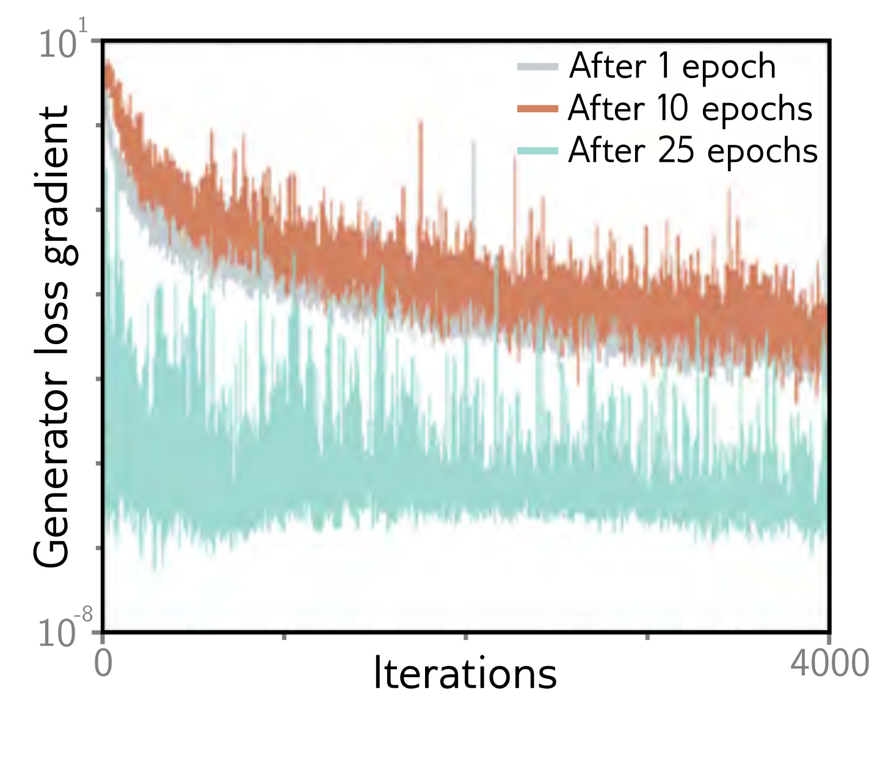

  

  <strong>Figure 15.7</strong> Vanishing gradients in the generator of a DCGAN. The generator is frozen after 1, 10, and 25 epochs, and the discriminator is trained further. The gradient of the generator decreases rapidly (note log scale); if the discriminator becomes too accurate, the gradients for the generator vanish. Adapted from Arjovsky & Bottou (2017).

becomes zero when the generated samples are too easy to distinguish from the real examples. The obvious way forward is to choose a distance metric with better properties.
The Wasserstein or (for discrete distributions) earth mover’s distance is the quantity of work required to transport the probability mass from one distribution to create the other. Here, “work” is defined as the mass multiplied by the distance moved. This immediately sounds more promising; the Wasserstein distance is well-defined even when the distributions are disjoint and decreases smoothly as they become closer to one another.

## 15.2.4 Wasserstein distance for discrete distributions

The Wasserstein distance is easiest to understand for discrete distributions (figure 15.8). Consider distributions  $Pr(x = i)$  and  $q(x = j)$  defined over K bins. Assume there is a cost  $C_{ij}$  associated with moving one unit of mass from bin i in the first distribution to bin j in the second; this cost might be the absolute difference  $|i - j|$  between the indices. The amounts that are moved form the transport plan and are stored in a matrix P.

The Wasserstein distance is defined as:

$$
\begin{aligned}
D_{w}\Big[Pr(x)||q(x)\Big]=\min_{\mathbf{P}}\left[\sum_{i,j}P_{ij}\cdot|i-j|\right],
\end{aligned} \quad (15.10)
$$

subject to the constraints that:

$$
\begin{aligned}
\begin{array}{ll}\sum_{i}P_{ij}&=Pr(x=i)\\ \sum_{i} P_{ij}&=\begin{array}{ll}q(x=j)\end{array}\\ \sum_{i}P_{ij}&\geq0\end{array}\begin{array}{ll}initial distribution of Pr(x)\\ initial distribution of q(x)\\ non-negative masses.\end{array}
\end{aligned} \quad (15.11)
$$

In other words, the Wasserstein distance is the solution to a constrained minimization problem that maps the mass of one distribution to the other. This is inconvenient as we must solve this minimization problem over the elements  $P_{ij}$  every time we want to compute the distance. Fortunately, this is a standard problem that is easily solved for small systems of equations. It is a linear programming problem in its primal form:
