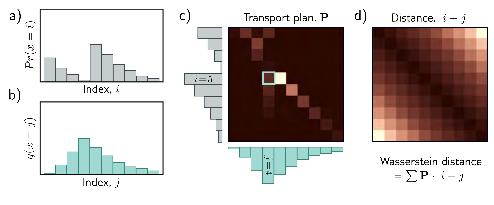
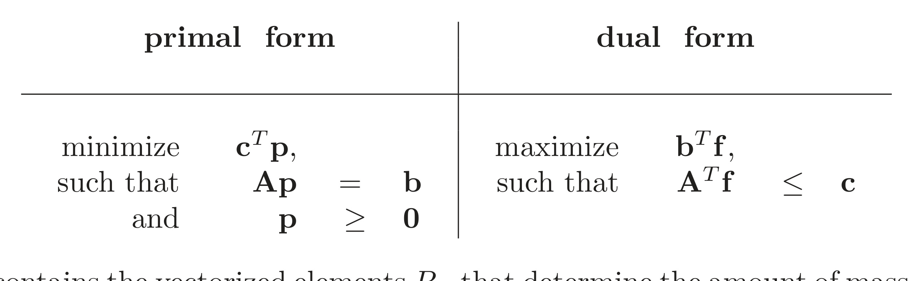

  

  <strong>Figure 15.8</strong> Wasserstein or earth mover’s distance.

c)

  

  <strong>Figure 15.8</strong> Wasserstein or earth mover’s distance. — Labels: c), d)

d)

Figure 15.8 Wasserstein or earth mover’s distance. a) Consider the discrete distribution  $Pr(x = i)$ . b) We wish to move the probability mass to create the target distribution  $q(x = j)$ . c) The transport plan P identifies how much mass will be moved from i to j. For example, the cyan highlighted square  $p_{54}$  indicates how much mass will be moved from i = 5 to j = 4. The elements of the transport plan must be non-negative, the sum over j must be  $Pr(x = i)$ , and the sum over i must be  $q(x = j)$ . Hence P is a joint probability distribution. d) The distance matrix between elements i and j. The optimal transport plan P minimizes the sum of the pointwise product of P and the distance matrix (termed the Wasserstein distance). Hence, the elements of P tend to lie close to the diagonal where the distance cost is lowest. Adapted from Hermann (2017).

<table><tr><td colspan="3">primal form</td><td>dual form</td></tr><tr><td>minimize such that and</td><td colspan="2">cTp, Ap = b p ≥ 0</td><td>maximize such that and</td></tr></table>

where p contains the vectorized elements $P_{ij}$ that determine the amount of mass moved, c contains the distances, $\mathbf{A}\mathbf{p} = \mathbf{b}$ contains the initial distribution constraints, and $\mathbf{p} \geq 0$ ensures the masses moved are non-negative.[^1] As for all linear programming problems, there is an equivalent dual problem with the same solution. Here, we maximize with respect to a variable f that is applied to the initial distributions, subject to constraints that depend on the distances c. The solution to this dual problem is:

$$
\begin{aligned}
D_{w}\Big[Pr(x)||q(x)\Big]=\max_{\mathbf{f}}\left[\sum_{i}Pr(x=i)f_{i}-\sum_{j}q(x=j)f_{j}\right],
\end{aligned}
\tag{15.12}
$$

[^1]: The mathematical background is omitted due to space constraints. Linear programming is a standard problem with well-known algorithms for finding the minimum.

Draft: please send errata to udlbookmail@gmail.com.
