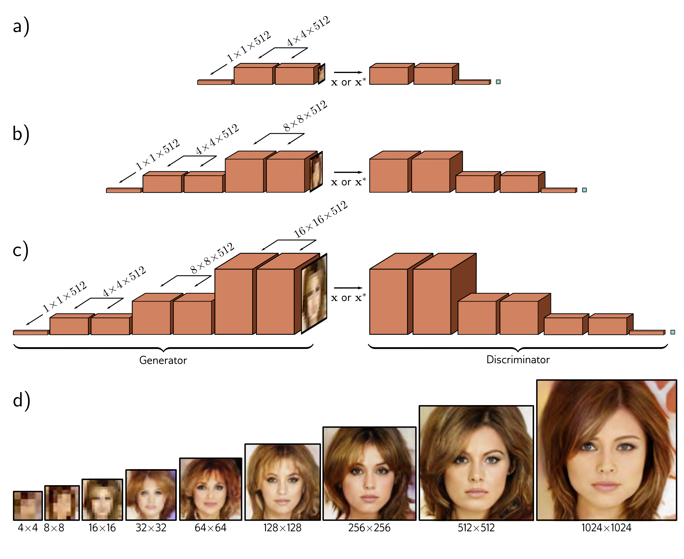

  

  <strong>Figure 15.9</strong> Progressive growing. a) The generator is initially trained to create very small  $4 \times 4$  images, and the discriminator to identify if these images are synthesized or downsampled real images. b) After training at this low-resolution terminates, subsequent layers are added to the generator to generate  $8 \times 8$  images. Similar layers are added to the discriminator to downsample back again. c) This process continues to create  $16 \times 16$  images and so on. In this way, a GAN that produces very realistic high-resolution images can be trained. d) Images of increasing resolution generated at different stages from the same latent variable. Adapted from Wolf (2021), using method of Karras et al. (2018).

## 15.3 Progressive growing, minibatch discrimination, and truncation

The Wasserstein formulation makes GAN training more stable. However, further machinery is needed to generate high-quality images. We now review progressive growing, minibatch discrimination, and truncation, which all improve output quality.

In progressive growing (figure 15.9), we first train a GAN that synthesizes  $4 \times 4$  images using an architecture similar to the DCGAN. Then we add subsequent layers to the generator, which upsample the representation and perform further processing to create
