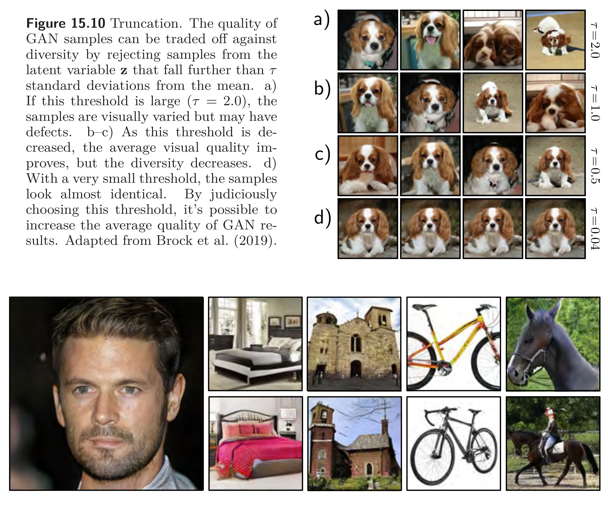
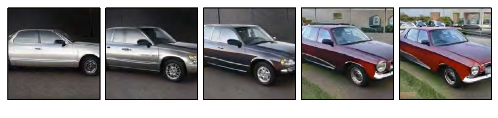

  

  <strong>Figure 15.10</strong> Truncation. The quality of GAN samples can be traded off against diversity by rejecting samples from the latent variable $z$ that fall further than $\tau$ standard deviations from the mean. a) If this threshold is large ($\tau = 2.0$), the samples are visually varied but may have defects. b-c) As this threshold is decreased, the average visual quality improves, but the diversity decreases. d) With a very small threshold, the samples look almost identical. By judiciously choosing this threshold, it is possible to increase the average quality of GAN results. Adapted from Brock et al. (2019).

  <strong>Figure 15.11</strong> Combining methods. GANs can generate realistic images of faces when trained on CELEBA-HQ dataset and more complex, variable objects when trained on LSUN categories. Adapted from Karras et al. (2018).

  

  <strong>Figure 15.12</strong> Traversing latent space of progressive GAN trained on LSUN cars. Moving in the latent space produces car images that change smoothly. This usually only works for short trajectories; eventually, the latent variable moves to somewhere that produces unrealistic images. Adapted from Karras et al. (2018).

