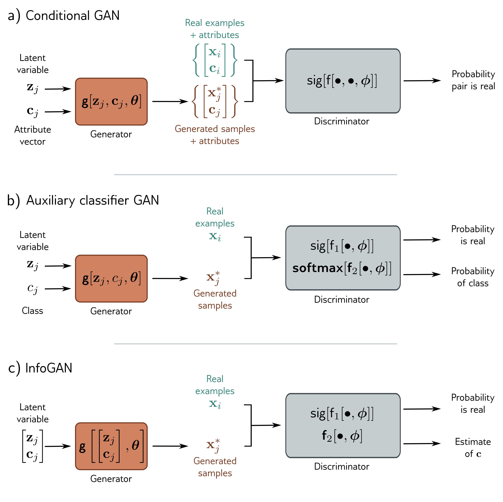

  

  <strong>Figure 15.13</strong> Conditional generation. a) The generator of the conditional GAN also receives an attribute vector c describing some aspect of the image. As usual, the discriminator receives either a real example or a generated sample, but now it also receives the attribute vector; this encourages the samples both to be realistic and compatible with the attribute. b) The generator of the auxiliary classifier GAN (ACGAN) takes a discrete attribute variable, and the discriminator must both (i) determine if its input is real or synthetic and (ii) identify the class correctly. c) The InfoGAN splits the latent variable into noise z and unspecified random attributes c. The discriminator must distinguish if its input is real and also reconstruct these attributes. In practice, this means that the variables c correspond to salient aspects of the data with real-world interpretations (i.e., the latent space is disentangled).

