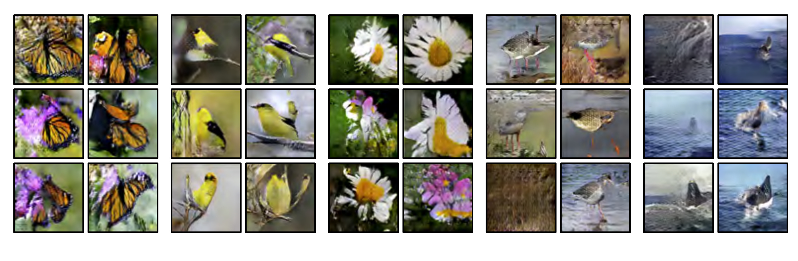

  

  <strong>Figure 15.14</strong> Auxiliary classifier GAN. The generator takes a class label as well as the latent vector. The discriminator must both identify if the data point is real and predict the class label. This model was trained on ten ImageNet classes. Left to right: generated examples of monarch butterflies, goldfinches, daisies, redshanks, and gray whales. Adapted from Odena et al. (2017).

attribute with C categories, the discriminator takes the real/synthesized image as input and has  $C + 1$  outputs; the first is passed through a sigmoid function and predicts if the sample is generated or real. The remaining outputs are passed through a softmax function to predict the probability that the data belongs to each of the C classes. Networks trained with this method can synthesize multiple classes from ImageNet (figure 15.14).

## 15.4.3 InfoGAN

The conditional GAN and ACGAN both generate samples that have predetermined attributes. By contrast, InfoGAN (figure 15.13c) attempts to identify important attributes automatically. The generator takes a vector consisting of random noise variables z and random attribute variables c. The discriminator both predicts whether the image is real or synthesized and estimates the attribute variables.

The insight is that interpretable real-world characteristics should be easiest to predict and hence will be represented in the attribute variables c. The attributes in c may be discrete (and a binary or multiclass cross-entropy loss would be used) or continuous (and a least squares loss would be used). The discrete variables identify categories in the data, and the continuous ones identify gradual modes of variation (figure 15.15).

## 15.5 Image translation

Although the adversarial discriminator was first used in the context of the GAN for generating random samples, it can also be used as a prior that favors realism in tasks that translate one data example into another. This is most commonly done with images,
