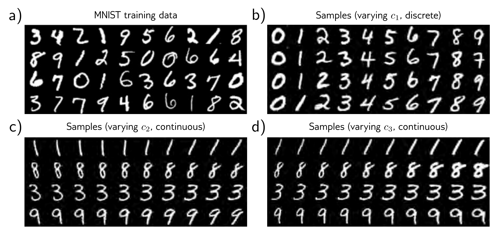

  

  <strong>Figure 15.15</strong> InfoGAN for MNIST. a) Training examples from the MNIST database, which consists of  $28 \times 28$  pixel images of handwritten digits. b) The first attribute  $c_{1}$  is categorical with 10 categories; each column shows samples generated with one of these categories. The InfoGAN recovers the ten digits. The attribute vectors  $c_{2}$  and  $c_{3}$  are continuous. c) Moving from left to right, each column represents a different value of  $c_{2}$  while keeping the other latent variables constant. This attribute seems to correspond to the orientation of the character. d) The third attribute seems to correspond to the thickness of the stroke. Adapted from Chen et al. (2016b).

where we might want to translate a grayscale image to color, a noisy image to a clean one, a blurry image to a sharp one, or a sketch to a photo-realistic image.

This section discusses three image translation models that use different amounts of manual labeling. The Pix2Pix model uses before/after pairs for training. Models with adversarial losses use before/after pairs for the main model but also exploit unpaired “after” images in the discriminator. The CycleGAN model uses unpaired images.

## 15.5.1 Pix2Pix

The Pix2Pix model (figure 15.16) is a network $\hat{\mathbf{x}} = \mathbf{g}[\mathbf{c}, \boldsymbol{\theta}]$ that maps one image $\mathbf{c}$ to a different style image $\mathbf{x}$ using an adversarial discriminator $f[\mathbf{c}, \mathbf{x}, \phi]$, which ingests the case would be colorization, where the input $\mathbf{c}$ is grayscale, and the output $g[\mathbf{c}, \boldsymbol{\theta}]$ is color. The output should be similar to the input, and this is encouraged using a content loss that penalizes the $\ell_{1}$ norm $\Vert\mathbf{x} - \mathbf{g}[\mathbf{c}, \boldsymbol{\theta}]\Vert_{1}$ between the input $\mathbf{c}$ and ground truth output $\mathbf{x}$.

However, the output image should also look like a realistic conversion of the input. This is encouraged by using an adversarial discriminator  $f[c, x, \phi]$ , which ingests the before and after images c and x. At each step, the discriminator tries to distinguish between a real before/after pair and a before/synthesized pair. To the extent that these
