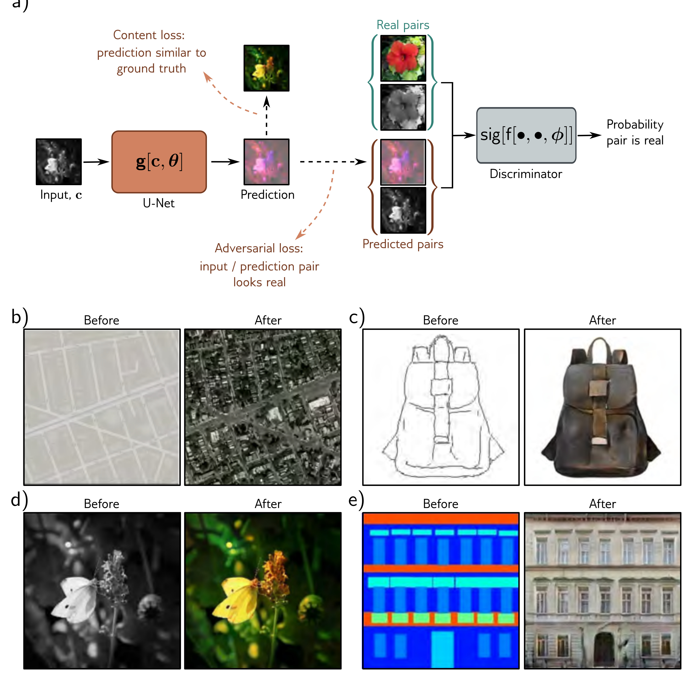

b)

d)

  

  <strong>Figure 15.16</strong> Pix2Pix model. a) The model translates an input image to a pre-diction in a different style using a U-Net (see figure 11.10). In this case, it maps a grayscale image to a plausibly colored version. The U-Net is trained with two losses. First, the content loss encourages the output image to have a similar structure to the input image. Second, the adversarial loss encourages the grayscale/color image pair to be indistinguishable from a real pair in each local region of these images. This framework can be adapted to many tasks, including b) translating maps to satellite imagery, c) converting sketches of bags to photorealistic examples, d) colorization, and e) converting label maps to photorealistic building facades. Adapted from Isola et al. (2017).

