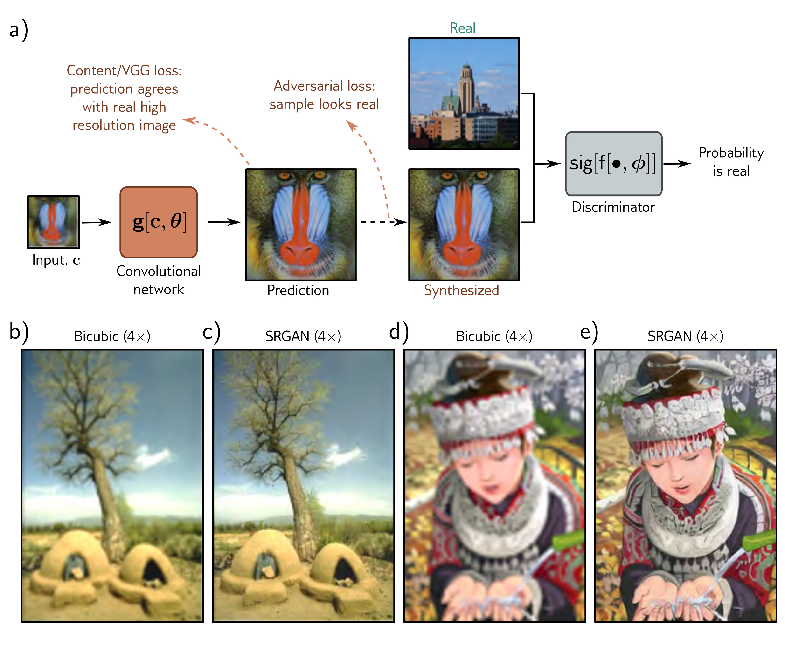

  

  <strong>Figure 15.17</strong> Super-resolution generative adversarial network (SRGAN). a) A convolutional network with residual connections is trained to increase the resolution of images by a factor of four. The model has losses that encourage the content to be close to the true high-resolution image. However, it also includes high-resolution images, which penalizes results that can be distinguished from real sampled image using bicubic interpolation. c) Upsampled image using SRGAN. d) Upsampled image using bicubic interpolation. e) Upsampled image using SRGAN. Adapted from Ledig et al. (2017).

