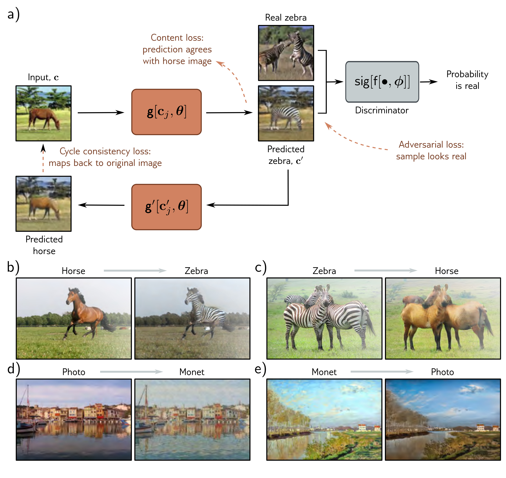

  

  <strong>Figure 15.18</strong> CycleGAN. Two models are trained simultaneously. The first $c' = g[c_j, \theta]$ translates from an image c in the first style (horse) to an image $c'$ in the second style (zebra). The second model $c = g'[c', \theta]$ learns the opposite mapping. The cycle consistency loss penalizes both models if they cannot successfully convert an image to the other domain and back to the original. In addition, two adversarial losses encourage the translated images to look like realistic examples of the target domain (shown here for zebra only). Two content losses encourage the details and layout of the images before and after each mapping to be similar (i.e., the zebra is in the same position and pose that the horse was against the same background and vice versa). Adapted from Zhu et al. (2017).

Draft: please send errata to udlbookmail@gmail.com.
