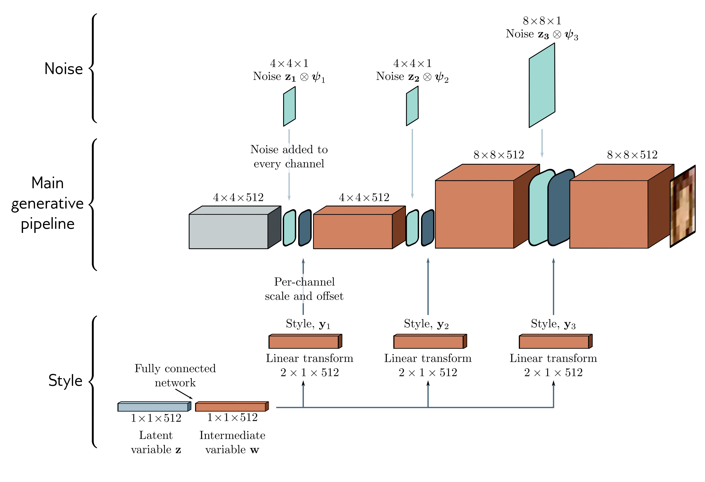

  

  <strong>Figure 15.19</strong> StyleGAN. The main pipeline (center row) starts with a constant learned representation (gray box). This is passed through a series of convolutional layers and gradually upsampled to create the output. Noise (top row) is added at different scales by periodically adding Gaussian variables $z_{\bullet}$ with per-channel scaling $\psi_{\bullet}$ . The Gaussian style variable z is passed through a fully connected network to create intermediate variable w (bottom row). This is used to set the mean and variance of each channel at various points in the pipeline.

main branch after noise addition. This is termed adaptive instance normalization (figure 11.14e). A series of vectors  $y_{1}, y_{2}, \ldots$  are injected in this way at several different points in the main branch, so the same style contributes at different scales. Figure 15.20 shows examples of manipulating the style and noise vectors at different scales.

## 15.7 Summary

GANs learn a generator network that transforms random noise into data that is indistinguishable from a training set. To this end, the generator is trained using a discriminator network that tries to distinguish real examples from generated samples. The generator is then updated so that the data that it creates is identified as being more “real” by the discriminator. The original formulation of this idea has the flaw that the training signal is weak when it’s easy to determine if the samples are real or generated. This led to the
