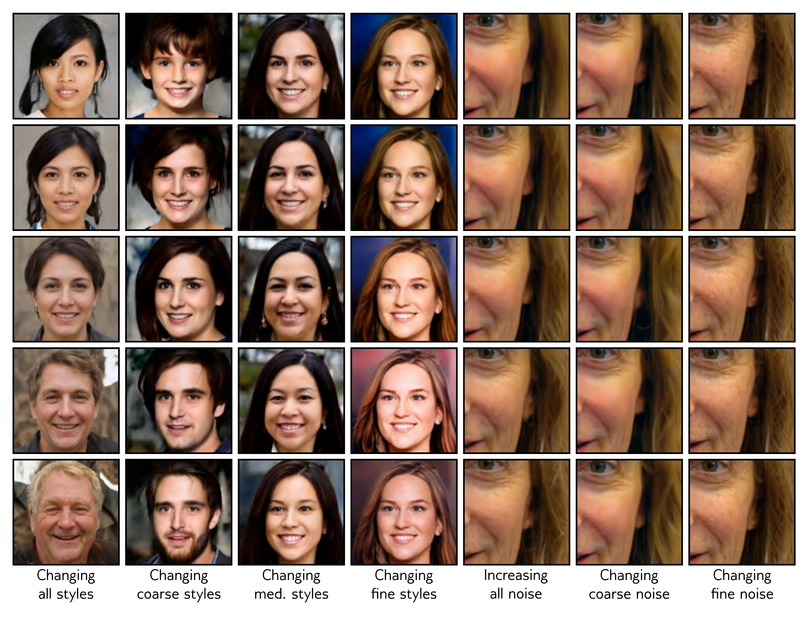

  

  <strong>Figure 15.20</strong> StyleGAN results. First four columns show systematic changes in style at various scales. Fifth column shows the effect of increasing noise magnitude. Last two columns show different noise vectors at two different scales.

Wasserstein GAN, which provides a more consistent training signal.

We reviewed convolutional GANs for generating images and a series of tricks that improve the quality of the generated images, including progressive growing, mini-batch discrimination, and truncation. Conditional GAN architectures introduce an auxiliary vector that allows control over the output (e.g., the choice of object class). Image translation tasks retain this conditional information in the form of an image but dispense with the random noise. The GAN discriminator now works as an additional loss term that favors “realistic” looking images. Finally, we described StyleGAN, which injects noise into the generator strategically to control the style and noise at different scales.

## Notes

Goodfellow et al. (2014) introduced generative adversarial networks. An early review of progress can be found in Goodfellow (2016). More recent overviews include Creswell et al. (2018) and
