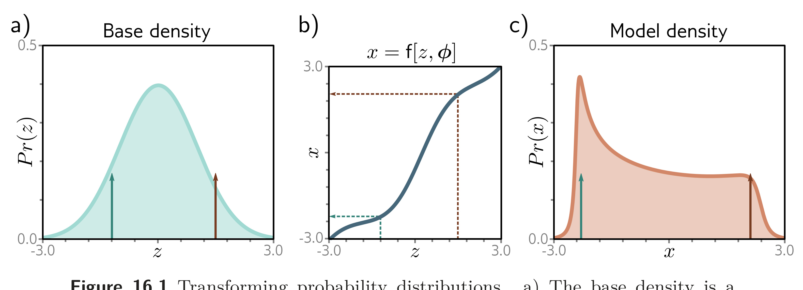
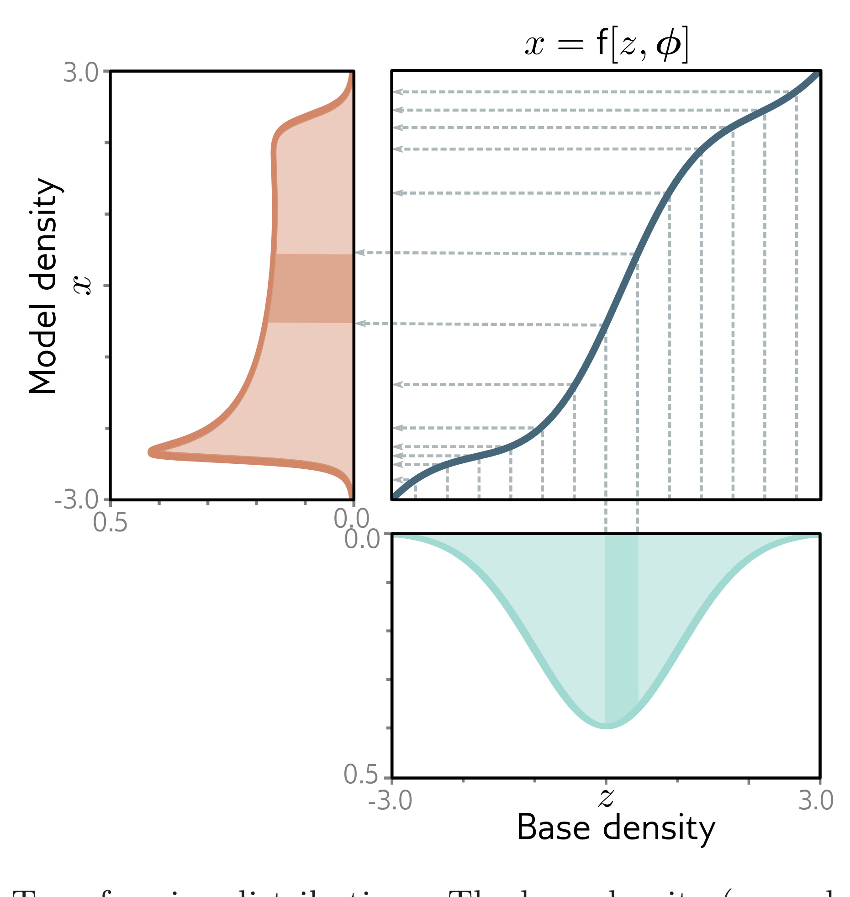

  

  <strong>Figure 16.1</strong> Transforming probability distributions. a) The base density is a standard normal defined on a latent variable z. b) This variable is transformed by a function $x = f[z, \phi]$ to a new variable x, which c) has a new distribution. To sample from this model, we draw values z from the base density (green and brown arrows in panel (a) show two examples). We pass these through the function $f[z, \phi]$ as shown by dotted arrows in panel (b) to generate the values of x, which are indicated as arrows in panel (c).

  

  <strong>Figure 16.2</strong> Transforming distributions. The base density (cyan, bottom) passes through a function (blue curve, top right) to create the model density (orange, left). Consider dividing the base density into equal intervals (gray vertical lines). The probability mass between adjacent lines must remain the same after transformation. The cyan-shaded region passes through a part of the function where the gradient is larger than one, so this region is stretched. Consequently, the height of the orange-shaded region must be lower so that it retains the same area as the cyan-shaded region. In other places (e.g., z = -2), the gradient is less than one, and the model density increases relative to the base density.

