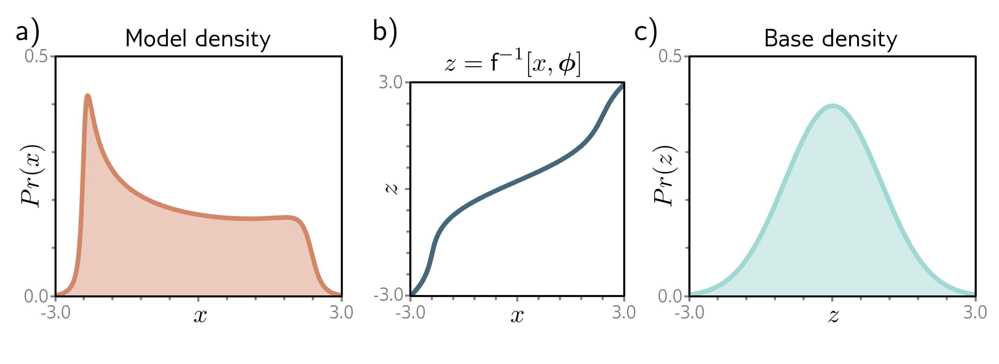

  

  <strong>Figure 16.3</strong> Inverse mapping (normalizing direction). If the function is invertible, then it's possible to transform the model density back to the original base density. The probability of a point x under the model density depends partly on the probability of the equivalent point z under the base density (see equation 16.1).

stretches the function. If a small change to the input causes a smaller change in the output, it compresses the function (figure 16.2).

More precisely, the probability of data x under the transformed distribution is:

$$
\Pr(x|\phi)\quad=\quad\left|\frac{\partial\mathrm{f}[z,\phi]}{\partial z}\right|^{-1}\cdot \Pr(z)
\qquad (16.1)
$$

where  $z = f^{-1}[x, \phi]$  is the latent variable that created x. The term  $\Pr(z)$  is the original probability of this latent variable under the base density. This is moderated according to the magnitude of the derivative of the function. If this is greater than one, then the probability decreases. If it is smaller, the probability increases.

## 16.1.2 Forward and inverse mappings

To draw samples from the distribution, we need the forward mapping $x = f[z, \phi]$, but to measure the likelihood, we need to compute the inverse $z = f^{-1}[x, \phi]$. Hence, we need to choose $\mathrm{f}[z, \phi]$ judiciously so that it is invertible.

The forward mapping is sometimes termed the generative direction. The base density is usually chosen to be a standard normal distribution. Hence, the inverse mapping is termed the normalizing direction since this takes the complex distribution over x and turns it into a normal distribution over z (figure 16.3).
