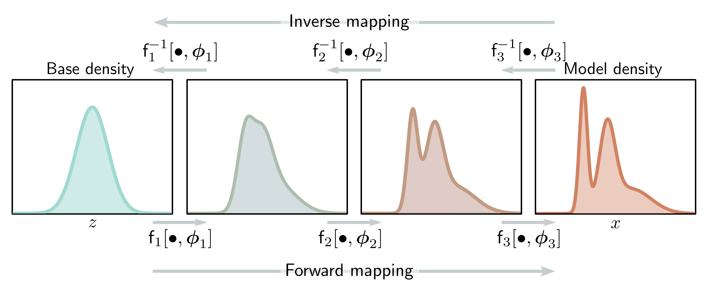

  

  <strong>Figure 16.4</strong> Forward and inverse mappings for a deep neural network. The base density (left) is gradually transformed by the network layers $f\_{1}[\bullet,\phi\_{1}]$ , $f\_{2}[\bullet,\phi\_{2}]$ , ... to create the model density. Each layer is invertible, and we can equivalently think of the inverse of the layers as gradually transforming (or "flowing") the model density back to the base density.

## 16.2.1 Forward mapping with a deep neural network

In practice, the forward mapping $\mathbf{f}[\mathbf{z}, \boldsymbol{\phi}]$ is usually defined by a neural network, consisting of a series of layers $\mathbf{f}\_{k}[\bullet, \boldsymbol{\phi}\_{k}]$ with parameters $\boldsymbol{\phi}\_{k}$, which are composed together as:

$$
\mathbf{x}=\mathbf{f}[\mathbf{z},\boldsymbol{\phi}]=\mathbf{f}_{K}\left[\mathbf{f}_{K-1}\Big[.\cdots\mathbf{f}_{2}\big[\mathbf{f}_{1}[\mathbf{z},\boldsymbol{\phi}_{1}],\boldsymbol{\phi}_{2}\big],.\cdots\boldsymbol{\phi}_{K-1}\Big]\right]
\qquad (16.4)
$$

The inverse mapping (normalizing direction) is defined by the composition of the inverse of each layer  $f\_{k}^{-1}[\bullet,\phi\_{k}]$  applied in the opposite order:

$$
\mathbf{z}=\mathbf{f}^{-1}[\mathbf{x},\boldsymbol{\phi}]=\mathbf{f}_{1}^{-1}\left[\mathbf{f}_{2}^{-1}\Big[.\cdots\mathbf{f}_{K-1}^{-1}\big[\mathbf{f}_{K}^{-1}[\mathbf{x},\boldsymbol{\phi}_{K}],\boldsymbol{\phi}_{K-1}\big],.\cdots\boldsymbol{\phi}_{2}\Big],\boldsymbol{\phi}_{1}\right]
\qquad (16.5)
$$

The base density  $\Pr(\mathbf{z})$  is usually defined as a multivariate standard normal (i.e., with mean zero and identity covariance). Hence, the effect of each subsequent inverse layer is to gradually move or "flow" the data density toward this normal distribution (figure 16.4). This gives rise to the name "normalizing flows."

The Jacobian of the forward mapping can be expressed as:

$$
\frac{\partial\mathbf{f}[\mathbf{z},\boldsymbol{\phi}]}{\partial\mathbf{z}}=\frac{\partial\mathbf{f}_{1}[\mathbf{z},\boldsymbol{\phi}_{1}]}{\partial\mathbf{z}}\cdot\frac{\partial\mathbf{f}_{2}[\mathbf{f}_{1},\boldsymbol{\phi}_{2}]}{\partial\mathbf{f}_{1}}\cdot\frac{\partial\mathbf{f}_{K-1}[\mathbf{f}_{K-2},\boldsymbol{\phi}_{K-1}]}{\partial\mathbf{f}_{K-2}}\cdot\cdot\cdot\frac{\partial\mathbf{f}_{K}[\mathbf{f}_{K-1},\boldsymbol{\phi}_{K}]}{\partial\mathbf{f}_{K-1}}
\qquad (16.6)
$$

where we have overloaded the notation to make $\mathbf{f}\_{k}$ the output of the function $\mathbf{f}\_{k}[\bullet,\phi\_{k}]$. The absolute determinant of this Jacobian can be computed by taking the product of the individual absolute determinants:
