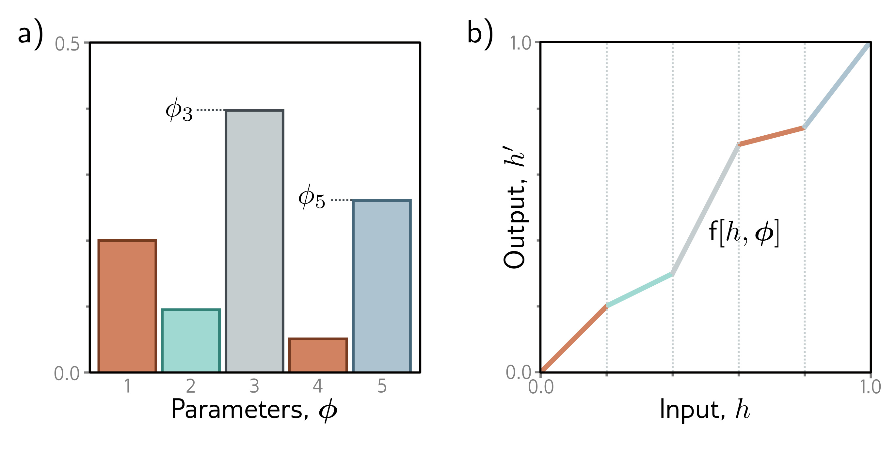

  

  <strong>Figure 16.5</strong> Piecewise linear mapping. An invertible piecewise linear mapping $h' = \mathrm{f}[h, \phi]$ can be created by dividing the input domain $h \in [0, 1]$ into $K$ equally sized regions (here $K = 5$). Each region has a slope with parameter, $\phi\_k$. a) If these parameters are positive and sum to one, then b) the function will be invertible and map to the output domain $h' \in [0, 1]$.

invertible one-to-one mapping. A simple example is a piecewise linear function with K regions (figure 16.5) which maps [0,1] to [0,1] as:

$$
\mathrm{f}[h,\phi]=\left(\sum_{k=1}^{b-1}\phi_{k}\right)+(h K-b+1)\phi_{b}
\qquad (16.12)
$$

where the parameters $\phi\_{1},\phi\_{2},\ldots,\phi\_{K}$ are positive and sum to 1, and $b=\lfloor Kh\rfloor+1$ is the index of the bin that contains $h$. The first term is the sum of all the preceding bins, and the second term represents the proportion of the way through the current bin that $h$ lies. This function is easy to invert, and its gradient can be calculated almost everywhere. There are many similar schemes for creating smooth functions, often using splines with parameters that ensure the function is monotonic and hence invertible.

Elementwise flows are nonlinear but don't mix input dimensions, so they can't create correlations between variables. When alternated with linear flows (which do mix dimensions), more complex transformations can be modeled. However, in practice, elementwise flows are used as components of more complex layers like coupling flows.

## 16.3.3 Coupling flows

Coupling flows divide the input h into two parts so that $\mathbf{h} = [\mathbf{h}\_{1}^{T}, \mathbf{h}\_{2}^{T}]^{T}$ and define the flow $\mathrm{f}[\mathbf{h}, \phi]$ as:
