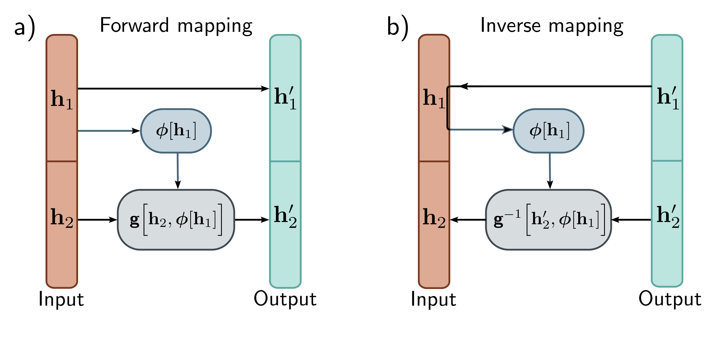

  

  <strong>Figure 16.6</strong> Coupling flows. a) The input (orange vector) is divided into $h\_{1}$ and $h\_{2}$ . The first part $h\_{1}^{\prime}$ of the output (cyan vector) is a copy of $h\_{1}$ . The output $h\_{2}^{\prime}$ is created by applying an invertible transformation $g[\bullet,\phi]$ to $h\_{2}$ , where the parameters $\phi$ are themselves a (not necessarily invertible) function of $h\_{1}$ . b) In the inverse mapping, $h\_{1}=h\_{1}^{\prime}$ . This allows us to calculate the parameters $\phi[h\_{1}]$ and then apply the inverse $g^{-1}[h\_{2}^{\prime},\phi]$ to retrieve $h\_{2}$ .

$$
\begin{aligned}
\mathbf{h}_{1}^{\prime}&=\mathbf{h}_{1}\\
\mathbf{h}_{2}^{\prime}&=g\left[\mathbf{h}_{2},\phi\left[\mathbf{h}_{1}\right]\right].
\end{aligned}
\qquad (16.13)
$$

Here  $g[\bullet,\phi]$  is an elementwise flow (or other invertible layer) with parameters  $\phi[h\_{1}]$  that are themselves a nonlinear function of the inputs  $h\_{1}$  (figure 16.6). The function  $\phi[\bullet]$  is usually a neural network of some kind and does not have to be invertible. The original variables can be recovered as:

$$
\begin{aligned}
\mathbf{h}_{1}&=\mathbf{h}_{1}^{\prime}\\
\mathbf{h}_{2}&=g^{-1}\left[\mathbf{h}_{2}^{\prime},\phi\left[\mathbf{h}_{1}\right]\right].
\end{aligned}
\qquad (16.14)
$$

If the function  $g[\bullet,\phi]$  is an elementwise flow, the Jacobian will be lower triangular with the identity matrix in the top-left quadrant and the derivatives of the elementwise transformation matrices between layers, so every variable is ultimately transformed by every other. In practice, these permutation matrices are difficult to learn. Hence, they are initialized randomly and then frozen. For structured data like images, the channels are divided into two halves  $h\_{1}$  and  $h\_{2}$  and permuted between layers using  $1\times1$  convolutions.

The inverse and Jacobian can be computed efficiently, but this approach only transforms the second half of the parameters in a way that depends on the first half. To make a more general transformation, the elements of h are randomly shuffled using permutation matrices between layers, so every variable is ultimately transformed by every other. In practice, these permutation matrices are difficult to learn. Hence, they are initialized randomly and then frozen. For structured data like images, the channels are divided into two halves  $h\_{1}$  and  $h\_{2}$  and permuted between layers using  $1\times1$  convolutions.
