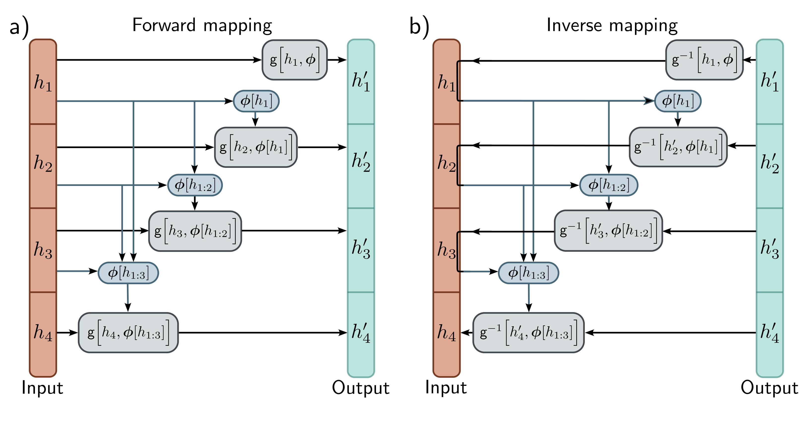

  

  <strong>Figure 16.7</strong> Autoregressive flows. The input h (orange column) and output $h'$ (cyan column) are split into their constituent dimensions (here four dimensions). a) Output $h'_{1}$ is an invertible transformation of input $h_{1}$ . Output $h'_{2}$ is an invertible function of input $h_{2}$ where the parameters depend on $h_{1}$ . Output $h'_{3}$ is an invertible function of input $h_{3}$ where the parameters depend on previous inputs $h_{1}$ and $h_{2}$ , and so on. None of the outputs depend on one another, so they can be computed in parallel. b) The inverse of the autoregressive flow is computed using a similar method as for coupling flows. However, notice that to compute $h_{2}$ we must already know $h_{1}$ , to compute $h_{3}$ , we must already know $h_{1}$ and $h_{2}$ , and so on. Consequently, the inverse cannot be computed in parallel.

## 16.3.4 Autoregressive flows

Autoregressive flows are a generalization of coupling flows that treat each input dimension as a separate "block" (figure 16.7). They compute the  $d^{th}$  dimension of the output  $h'$  based on the first d-1 dimensions of the input h:

$$
h_{d}^{\prime}=\mathbf{g}\left[h_{d},\phi[\mathbf{h}_{1:d-1}]\right]
\qquad (16.15)
$$

The function  $g[\bullet,\bullet]$  is termed the transformer, [^1]  and the parameters  $\phi,\phi[h_{1}],\phi[h_{1},h_{2}]$ , are termed conditioners. As for coupling flows, the transformer  $g[\bullet,\phi]$  can take any form and are usually neural networks. If the transformer and conditioner are sufficiently flexible, autoregressive flows are universal approximators in that they can represent any probability distribution.

It's possible to compute all of the entries of the output h' in parallel using a network with appropriate masks so that the parameters  $\phi$  at position d only depend on previous
