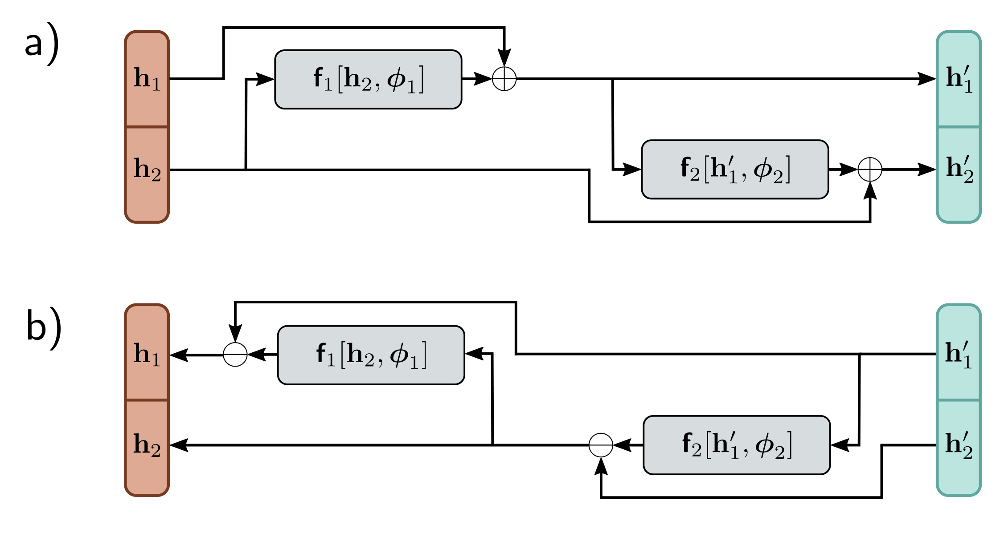

  

  <strong>Figure 16.8</strong> Residual flows. a) An invertible function is computed by splitting the input into $h\_{1}$ and $h\_{2}$ and creating two residual layers. In the first, $h\_{2}$ is processed and $h\_{1}$ is added. In the second, the result is processed, and $h\_{2}$ is added. b) In the reverse mechanism the functions are computed in the opposite order, and the addition operation becomes subtraction.

$$
\begin{aligned}
\mathbf{h}_{1}^{\prime}&=\mathbf{h}_{1}+\mathbf{f}_{1}[\mathbf{h}_{2},\boldsymbol{\phi}_{1}]\\
\mathbf{h}_{2}^{\prime}&=\mathbf{h}_{2}+\mathbf{f}_{2}[\mathbf{h}_{1}^{\prime},\boldsymbol{\phi}_{2}]
\end{aligned}
\qquad (16.18)
$$

where $\mathbf{f}\_{1}[\bullet,\phi\_{1}]$ and $\mathbf{f}\_{2}[\bullet,\phi\_{2}]$ are two functions that do not necessarily have to be invertible (figure 16.8). The inverse can be computed by reversing the order of computation:

$$
\begin{aligned}
\mathbf{h}_{2}&=\mathbf{h}_{2}^{\prime}-\mathbf{f}_{2}[\mathbf{h}_{1}^{\prime},\boldsymbol{\phi}_{2}]\\
\mathbf{h}_{1}&=\mathbf{h}_{1}^{\prime}-\mathbf{f}_{1}[\mathbf{h}_{2},\boldsymbol{\phi}_{1}].
\end{aligned}
\qquad (16.19)
$$

As for coupling flows, the division into blocks restricts the family of transformations that can be represented. Hence, the inputs are permuted between layers so that the variables can mix in arbitrary ways.

This formulation can be inverted easily, but for general functions  $f\_{1}[\bullet,\phi\_{1}]$  and  $f\_{2}[\bullet,\phi\_{2}]$ , there is no efficient way to compute the Jacobian. This formulation is sometimes used to save memory when training residual networks; because the network is invertible, storing the activations at each layer in the forward pass is unnecessary.

## 16.3.7 Residual flows and contraction mappings: iResNet

A different approach to exploiting residual networks is to utilize the Banach fixed point theorem or contraction mapping theorem, which states that every contraction mapping has a fixed point. A contraction mapping  $f[\bullet]$  has the property that:
