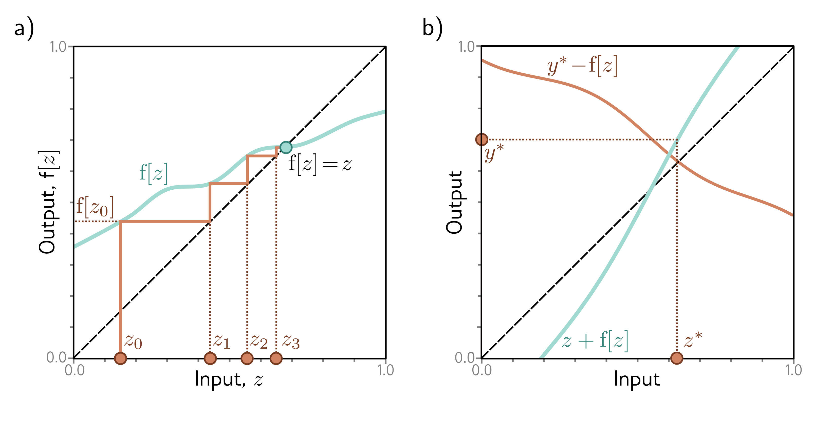

  

  <strong>Figure 16.9</strong> Contraction mappings. If a function has an absolute slope of less than one everywhere, iterating the function converges to a fixed point $f[z] = z$ . a) Starting at $z\_{0}$ , we evaluate $z\_{1} = f[z\_{0}]$ . We then pass $z\_{1}$ back into the function and iterate. Eventually, the process converges to the point where $f[z] = z$ (i.e., where the function crosses the dashed diagonal identity line). b) This can be used to invert equations of the form $y = z + f[z]$ for a value $y^{*}$ by noticing that the fixed point of $y^{*} - f[z]$ (where the orange line crosses the dashed identity line) is at the same position as where $y^{*} = z + f[z]$ .

$$
\mathrm{dist}\left[\mathbf{f}[z^{\prime}],\mathbf{f}[z]\right]<\beta\cdot\mathrm{dist}\left[z^{\prime},z\right]\qquad\quad\forall z,z^{\prime}
\qquad (16.20)
$$

where dist[ $\bullet$ , $\bullet$ ] is a distance function and 0 <  $\beta < 1$ . When a function with this property is iterated (i.e., the output is repeatedly passed back in as an input), the result converges to a fixed point where  $f[z] = z$  (figure 16.9). To understand this, consider applying the function to both the fixed point and the current position; the fixed point remains static, but the distance between the two must become smaller, so the current position must get closer to the fixed point.

This theorem can be exploited to invert an equation of the form:

$$
y=z+\mathbf{f}[z]
\qquad (16.21)
$$

if f[z] is a contraction mapping. In other words, it can be used to find the  $z^{*}$  that maps to a given value,  $y^{*}$ . This can be done by starting with any point  $z\_{0}$  and iterating  $z\_{k+1}=y^{*}-\mathbf{f}[z\_{k}]$ . This has a fixed point at  $z+\mathbf{f}[z]=y^{*}$  (figure 16.9b).

The same principle can be used to invert residual network layers of the form  $\mathbf{h}' = \mathbf{h} + f[\mathbf{h}, \phi]$  if we ensure that  $f[h, \phi]$  is a contraction mapping. In practice, this means that the Lipschitz constant must be less than one. Assuming that the slope of the activation functions is not greater than one, this is equivalent to ensuring the largest singular value
