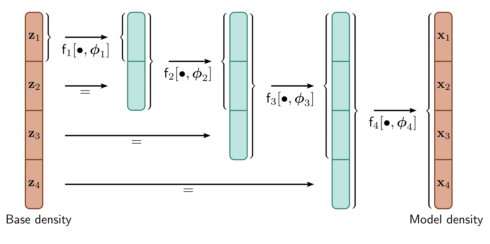

  

  <strong>Figure 16.10</strong> Multiscale flows. The latent space z must be the same size as the model density in normalizing flows. However, it can be partitioned into several components, which can be gradually introduced at different layers. This makes both density estimation and sampling faster. For the inverse process, the black arrows are reversed, and the last part of each block skips the remaining processing. For example, $f\_{3}^{-1}[\bullet,\phi\_{3}]$ only operates on the first three blocks, and the fourth block becomes $z\_{4}$ and is assessed against the base density.

some point, we have to introduce all of these variables, but it is inefficient to pass them through the entire network. This leads to the idea of multi-scale flows (figure 16.10).

In the generative direction, multi-scale flows partition the latent vector into z = [z_{1}, z_{2}, ..., z_{N}]. The first partition  $z\_{1}$  is processed by a series of reversible layers with the same dimension as  $z\_{1}$  until, at some point,  $z\_{2}$  is appended and combined with the first partition. This continues until the network is the same size as the data x. In the normalizing direction, the network starts at the full dimension of x, but when it reaches the point where  $z\_{n}$  was added, this is assessed against the base distribution.

## 16.5 Applications

We now describe three applications of normalizing flows. First, we consider modeling probability densities. Second, we consider the GLOW model for synthesizing images. Finally, we discuss using normalizing flows to approximate other distributions.

## 16.5.1 Modeling densities

Of the four generative models discussed in this book, normalizing flows is the only model that can compute the exact log-likelihood of a new sample. Generative adversarial
