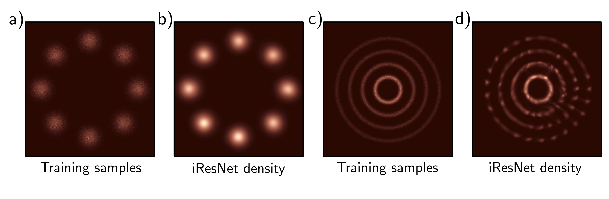

  

  <strong>Figure 16.11</strong> Modeling densities. a) Toy 2D data samples. b) Modeled density using iResNet. c-d) Second example. Adapted from Behrmann et al. (2019)

networks are not probabilistic, and both variational autoencoders and diffusion models can only return a lower bound on the likelihood. [^2]  Figure 16.11 depicts the estimated probability distributions in two toy problems using i-ResNet. One application of density estimation is anomaly detection; the data distribution of a clean dataset is described using a normalizing flow model. New examples with low probability are flagged as outliers. However, caution must be used as there may exist outliers with high probability that don't fall in the typical set (see figure 8.13).

## 16.5.2 Synthesis

Generative flows, or GLOW, is a normalizing flow model that can create high-fidelity images (figure 16.12) and uses many of the ideas from this chapter. It is easiest understood in the normalizing direction. GLOW starts with a  $256 \times 256 \times 3$  tensor containing an RGB image. It uses coupling layers, in which the channels are partitioned into two halves. The second half is subject to a different affine transform at each spatial position, where the parameters of the affine transformation are computed by a 2D convolutional neural network run on the other half of the channels. The coupling layers are alternated with  $1 \times 1$  convolutions, parameterized as LU decompositions which mix the channels.

Periodically, the resolution is halved by combining each  $2 \times 2$  patch into one position with four times as many channels. GLOW is a multi-scale flow, and some of the channels are periodically removed to become part of the tails. This is similar to the truncation trick in GANs.

To sample more realistic images, the GLOW model samples from the base density raised to a positive power. This chooses examples that are closer to the center of the density rather than from the tails. This is similar to the truncation trick in GANs
