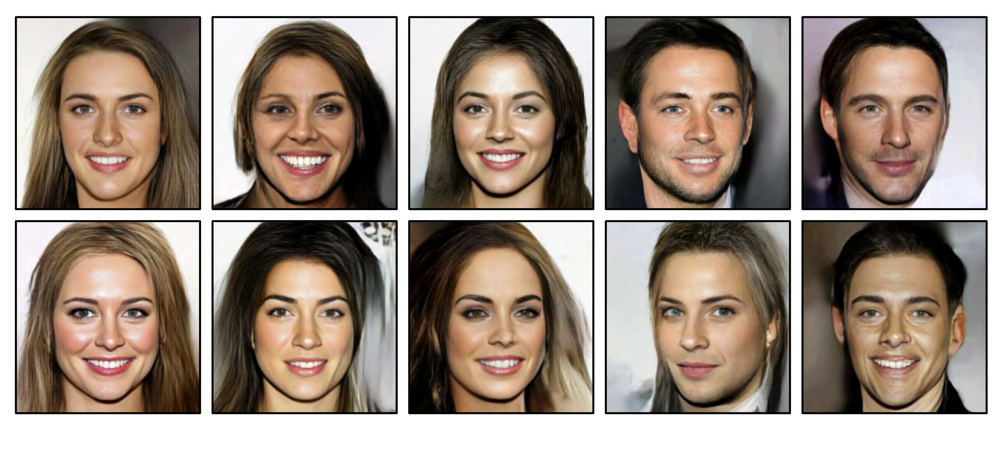
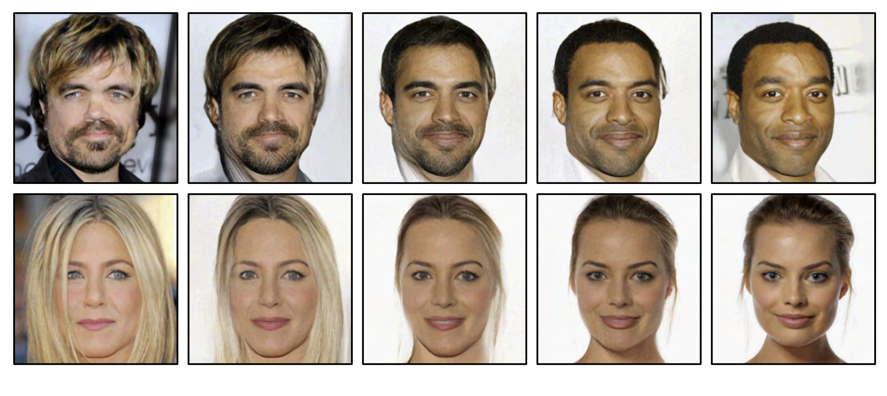

  

  <strong>Figure 16.12</strong> Samples from GLOW trained on the CelebA HQ dataset (Karras et al., 2018). The samples are of reasonable quality, although GANs and diffusion models produce superior results. Adapted from Kingma & Dhariwal (2018).

  

  <strong>Figure 16.13</strong> Interpolation using GLOW model. The left and right images are real people. The intermediate images were computed by projecting the real images to the latent space, interpolating, and then projecting the interpolated points back to image space. Adapted from Kingma & Dhariwal (2018).

