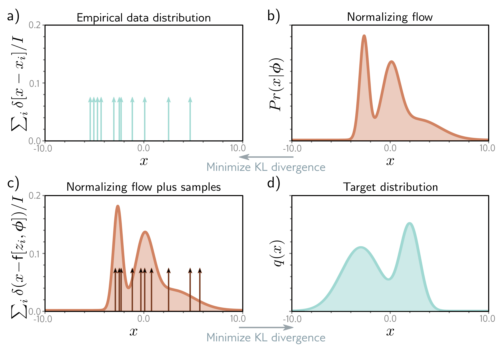

  

  <strong>Figure 16.14</strong> Approximating density models.

c)

d)

Figure 16.14 Approximating density models. a) Training data. b) Usually, we modify the flow model parameters to minimize the KL divergence from the training data to the flow model. This is equivalent to maximum likelihood fitting (section 5.7). c) Alternatively, we can modify the flow parameters $\phi$ to minimize the KL divergence from the flow samples $x_{i} = f[z_{i}, \phi]$ to d) a target density.

are still useful in their own right even when the Jacobian cannot be estimated efficiently; they reduce the memory requirements of training a K-layer network from $O[K]$ to $O[1]$ .

This chapter reviewed invertible network layers or flows. We considered linear flows and elementwise flows, which are simple but insufficiently expressive. Then we described more complex flows, such as coupling, autoregressive, and residual flows. Finally, we showed how normalizing flows can be used to estimate likelihoods, generate and interpolate between images, and approximate other distributions.

## Notes

Normalizing flows were first introduced by Rezende & Mohamed (2015) but had intellectual antecedents in the work of Tabak & Vanden-Eijnden (2010), Tabak & Turner (2013), and Rippel & Adams (2013). Reviews of normalizing flows can be found in Kobyzev et al. (2020) and Papamakarios et al. (2021). Kobyzev et al. (2020) presented a quantitative comparison of
