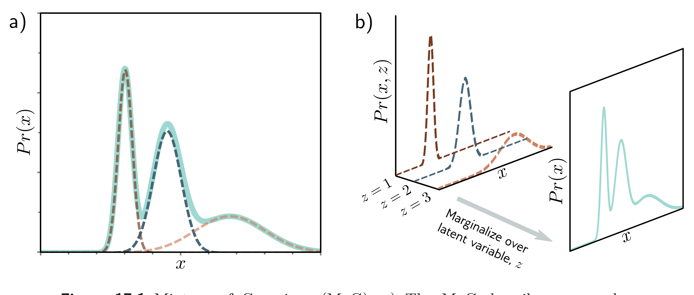

  

  <strong>Figure 17.1</strong> Mixture of Gaussians (MoG). a) The MoG describes a complex probability distribution (cyan curve) as a weighted sum of Gaussian components (dashed curves). b) This sum is the marginalization of the joint density $\Pr(x, z)$ between the continuous observed data x and a discrete latent variable z.

$$
\Pr(\mathbf{x}|\mathbf{z},\boldsymbol{\phi})=\mathrm{Norm}_{\mathbf{x}}\Big[\mathbf{f}[\mathbf{z},\boldsymbol{\phi}],\sigma^{2}\mathbf{I}\Big]
\qquad (17.6)
$$

The function $\mathbf{f}[\mathbf{z},\boldsymbol{\phi}]$ is described by a deep network with parameters $\varphi$. The latent variable $\mathbf{z}$ is lower dimensional than the data $\mathbf{x}$. The model $\mathbf{f}[\mathbf{z},\boldsymbol{\phi}]$ describes the important aspects of the data, and the remaining unmodeled aspects are ascribed to the noise $\sigma^{2}\mathbf{I}$.

The data probability $\Pr(\mathbf{x}|\boldsymbol{\phi})$ is found by marginalizing over the latent variable $\mathbf{z}$:

(17.6)

$$
\begin{aligned}
\Pr(\mathbf{x}|\boldsymbol{\phi})&=\int \Pr(\mathbf{x},\mathbf{z}|\boldsymbol{\phi})d\mathbf{z}\\
&=\int \Pr(\mathbf{x}|\mathbf{z},\boldsymbol{\phi})\cdot \Pr(\mathbf{z})d\mathbf{z}\\
&=\int \mathrm{Norm}_{\mathbf{x}}\Big[\mathbf{f}[\mathbf{z},\boldsymbol{\phi}],\sigma^{2}\mathbf{I}\Big]\cdot \mathrm{Norm}_{\mathbf{z}}\left[\boldsymbol{0},\mathbf{I}\right]d\mathbf{z}.
\end{aligned}
\qquad (17.7)
$$

This can be viewed as an infinite weighted sum (i.e., an infinite mixture) of spherical Gaussians with different means, where the weights are  $\Pr(\mathbf{z})$  and the means are the network outputs  $f[\mathbf{z}, \phi]$  (figure 17.2).

## 17.2.1 Generation

A new example $\mathbf{x}^{*}$ can be generated using ancestral sampling (figure 17.3). We draw $\mathbf{z}^{*}$ from the prior $\Pr(\mathbf{z})$ and pass this through the network $\mathbf{f}[\mathbf{z}^{*}, \phi]$ to compute the mean of the likelihood $\Pr(\mathbf{x}|\mathbf{z}^{*}, \phi)$ (equation 17.6), from which we draw $\mathbf{x}^{*}$. Both the prior and likelihood are normal distributions, so this is straightforward.

Latent variable models
