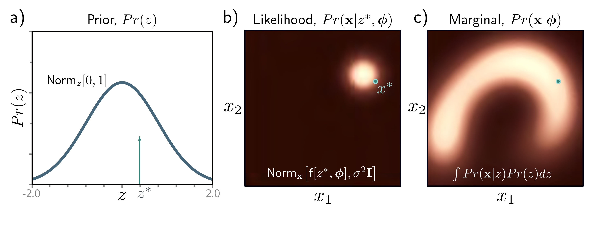
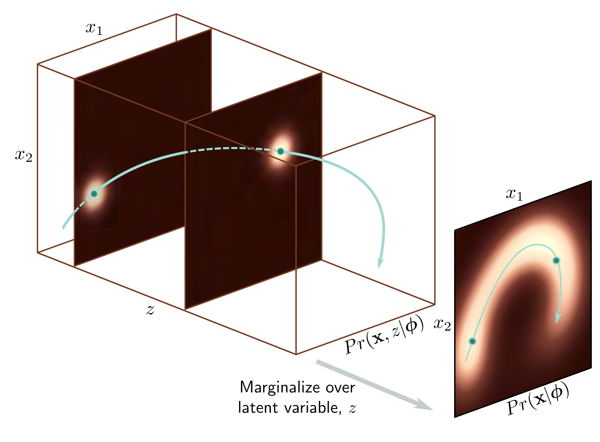

  

  <strong>Figure 17.2</strong> Nonlinear latent variable model. A complex 2D density $Pr(\mathbf{x}, z)$ (left) over the latent variable z; to create $Pr(\mathbf{x})$ , we integrate the 3D volume over the dimension z. For each z, the distribution over x is a spherical Gaussian (two slices shown) with a mean $f[z, \phi]$ that is a nonlinear function of z and depends on parameters $\Phi$ . The distribution $Pr(\mathbf{x})$ is a weighted sum of these Gaussians.

a)

  

  <strong>Figure 17.3</strong> Generation from nonlinear latent variable model. a) We draw a sample $z^{*}$ from the prior probability $Pr(z)$ over the latent variable. b) A sample $x^{*}$ is then drawn from $Pr(\mathbf{x}|z^{*}, \phi)$ . This is a spherical Gaussian with a mean that is a nonlinear function $f[\bullet, \phi]$ of $z^{*}$ and a fixed variance $\sigma^{2}\mathbf{I}$ . c) If we repeat this process many times, we recover the density $Pr(\mathbf{x}|\phi)$ .

