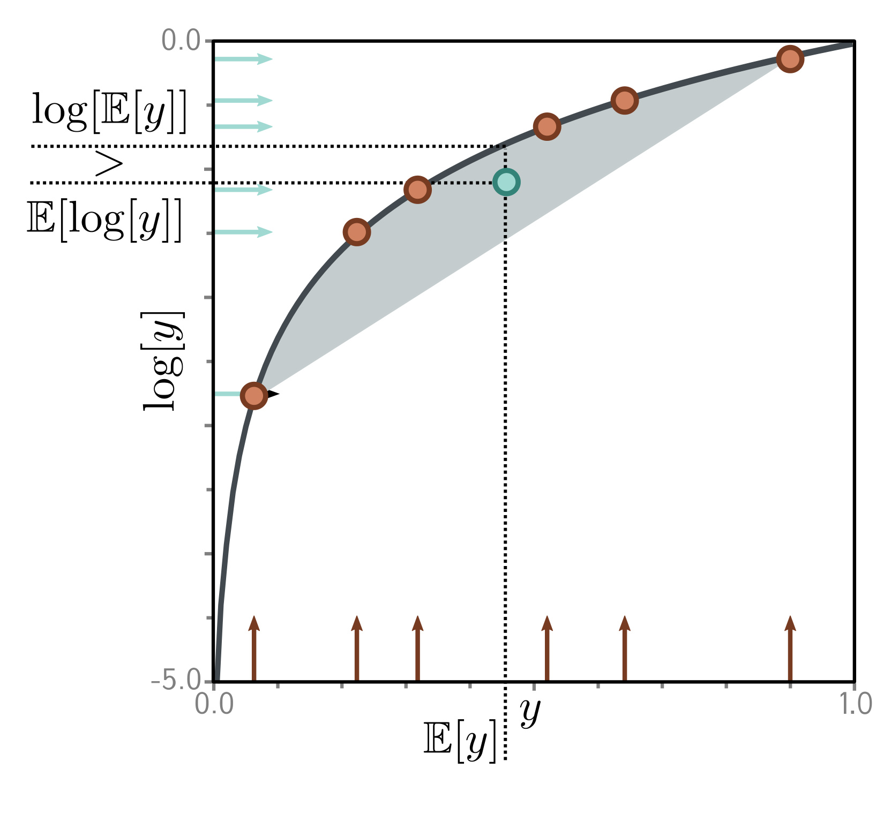

  

  <strong>Figure 17.4</strong> Jensen's inequality (discrete case). The logarithm (black curve) is a concave function; you can draw a straight line between any two points on the curve, and this line will always lie underneath it. It follows that any convex combination (weighted sum with positive weights that sum to one) of the six points on the log function must lie in the gray region under the curve. Here, we have weighted the points equally (i.e., taken the mean) to yield the cyan point. Since this point lies below the curve, $\log[\mathbb{E}[y]] > \mathbb{E}[\log[y]]$ .

## 17.3 Training

To train the model, we maximize the log-likelihood over a training dataset $\lbracex_{i}\rbrace_{i=1}^{I}$ with respect to the model parameters. For simplicity, we assume that the variance term $\sigma^{2}$ in the likelihood expression is known and concentrate on learning $\phi$ : 

$$
\hat{\boldsymbol{\phi}}\quad=\quad\underset{\boldsymbol{\phi}}{\mathrm{argmax}}\left[\sum_{i=1}^{I}\log\left[Pr(\mathbf{x}_{i}|\boldsymbol{\phi})\right]\right], \quad (17.8)
$$

 where: 

$$
\hat{\boldsymbol{p}}\quad=\quad\underset{\phi}{\mathrm{argmax}}[\sum_{i=1}^{I}\log\left[Pr(\mathbf{x}_{i}|\boldsymbol{\phi})\right], \quad (17.9)
$$

 where: 

$$
Pr(\mathbf{x}_{i}|\boldsymbol{\phi})\quad=\quad\int\mathrm{Norm}_{\mathbf{x}_{i}}[\mathbf{f}[\mathbf{z},\boldsymbol{\phi}],\sigma^{2}\mathbf{I}]\cdot\mathrm{Norm}_{\mathbf{z}}[\mathbf{0},\mathbf{I}]d\mathbf{z}. \quad (17.9)
$$

 Unfortunately, this is intractable. There is no closed-form expression for the integral and no easy way to evaluate it for a particular value of x.

## 17.3.1 Evidence lower bound (ELBO)

To make progress, we define a lower bound on the log-likelihood. This is a function that is always less than or equal to the log-likelihood for a given value of $\phi$ and will also depend on some other parameters $\theta$ . Eventually, we will build a network to compute this lower bound and optimize it. To define this lower bound, we need Jensen's inequality.

## 17.3.2 Jensen's inequality

Jensen's inequality says that a concave function $g[\bullet]$ of the expectation of data $y$ is greater than or equal to the expectation of the function of the data:

Appendix B.1.2
Concave functions
