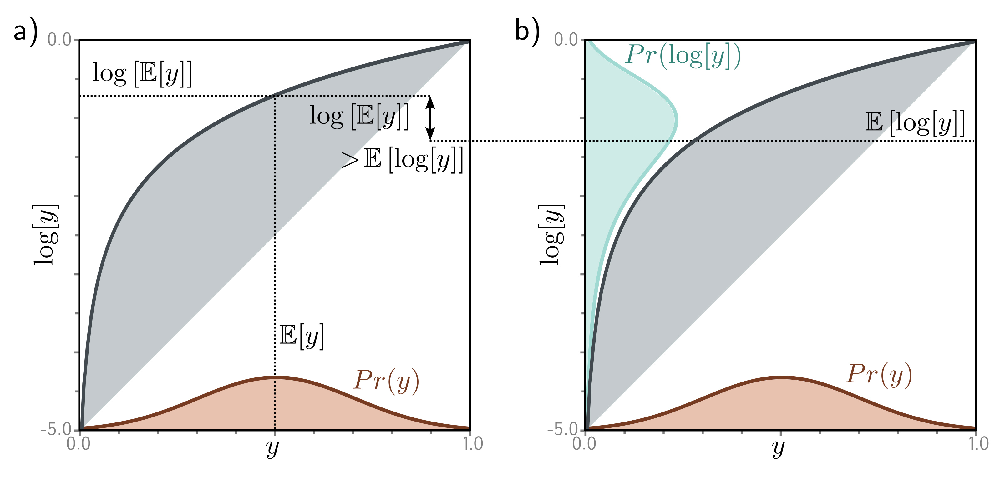

  

  <strong>Figure 17.5</strong> Jensen's inequality (continuous case).

Figure 17.5 Jensen's inequality (continuous case). For a concave function, computing the expectation of a distribution $Pr(y)$ and passing it through the function gives a result greater than or equal to transforming the variable y by the function and then computing the expectation of the new variable. In the case of the logarithm, we have $\log[\mathbb{E}[y]] \geq \mathbb{E}[\log[y]]$ . The left-hand side of the figure corresponds to the left-hand side of this inequality and the right-hand side of the figure to the right-hand side. One way of thinking about this is to consider that we are taking a convex combination of the points in the orange distribution defined over $y \in [0,1]$ . By the logic of figure 17.4, this must lie under the curve. Alternatively, we can think about the concave function as compressing the high values of y relative to the low values, so the expected value is lower when we pass y through the function first. 

$$
g[\mathbb{E}[y]]\geq\mathbb{E}\big[g[y]\big]. \quad (17.10)
$$

 In this case, the concave function is the logarithm, so we have:

Problems 17.2-17.3 

$$
\log\left[\mathbb{E}[y]\right]\geq\mathbb{E}\bigl[\log[y]\bigr]. \quad (17.11)
$$

 or writing out the expression for the expectation in full, we have: 

$$
\log\left[\int Pr(y)h[y]dy\right]\geq\int Pr(y)\log[h[y]]dy. \quad (17.12)
$$

 This is explored in figures 17.4-17.5. In fact, the slightly more general statement is true: 

$$
\log\left[\int Pr(y)h[y]dy\right]\geq\int Pr(y)\log[h[y]]dy. \quad (17.13)
$$

 where $h[y]$ is a function of $y$. This follows because $h[y]$ is another random variable with a new distribution. Since we never specified $Pr(y)$, the relation remains true.
