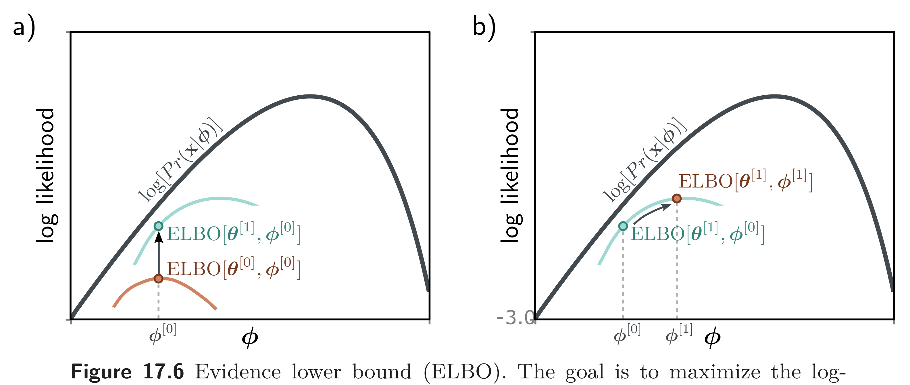

a)

  

  <strong>Figure 17.6</strong> Evidence lower bound (ELBO). The goal is to maximize the log-likelihood $\log[\Pr(\mathbf{x}|\phi)]$ (black curve) with respect to the parameters $\phi$ . The ELBO is a function that lies everywhere below the log-likelihood. It is a function of both $\phi$ and a second set of parameters $\theta$ . For fixed $\theta$ , we get a function of $\phi$ (two colored curves for different values of $\theta$ ). Consequently, we can increase the log-likelihood by either improving the ELBO with respect to a) the new parameters $\theta$ (moving from colored curve to colored curve) or b) the original parameters $\phi$ (moving along the current colored curve).

## 17.3.3 Deriving the bound

We now use Jensen's inequality to derive the lower bound for the log-likelihood. We start by multiplying and dividing the log-likelihood by an arbitrary probability distribution  $q(\mathbf{z})$  over the latent variables:

$$
\begin{aligned}
\log[\Pr(\mathbf{x}|\boldsymbol{\phi})]&\quad=\quad\log\left[\int \Pr(\mathbf{x},\mathbf{z}|\boldsymbol{\phi})d\mathbf{z}\right]\\
&=\quad\log\left[\int q(\mathbf{z})\frac{\Pr(\mathbf{x},\mathbf{z}|\boldsymbol{\phi})}{q(\mathbf{z})}d\mathbf{z}\right]
\end{aligned}
\qquad (17.14)
$$

We then use Jensen's inequality for the logarithm (equation 17.12) to find a lower bound:

$$
\log\left[\int q(\mathbf{z})\frac{\Pr(\mathbf{x},\mathbf{z}|\boldsymbol{\phi})}{q(\mathbf{z})}d\mathbf{z}\right]\quad\geq\quad\int q(\mathbf{z})\log\left[\frac{\Pr(\mathbf{x},\mathbf{z}|\boldsymbol{\phi})}{q(\mathbf{z}|}\right]d\mathbf{z}
\qquad (17.15)
$$

where the right-hand side is termed the evidence lower bound or ELBO. It gets this name because  $\Pr(\mathbf{x}|\boldsymbol{\phi})$  is called the evidence in the context of Bayes' rule (equation 17.19).

In practice, the distribution $q(\mathbf{z})$ has parameters $\theta$, so the ELBO can be written as:

$$
\mathrm{ELBO}[\boldsymbol{\theta},\phi]=\int q(\mathbf{z}|\boldsymbol{\theta})\log\left[\frac{\Pr(\mathbf{x},\mathbf{z}|\phi)}{q(\mathbf{z}|\boldsymbol{\theta})}\right]d\mathbf{z}
\qquad (17.16)
$$
