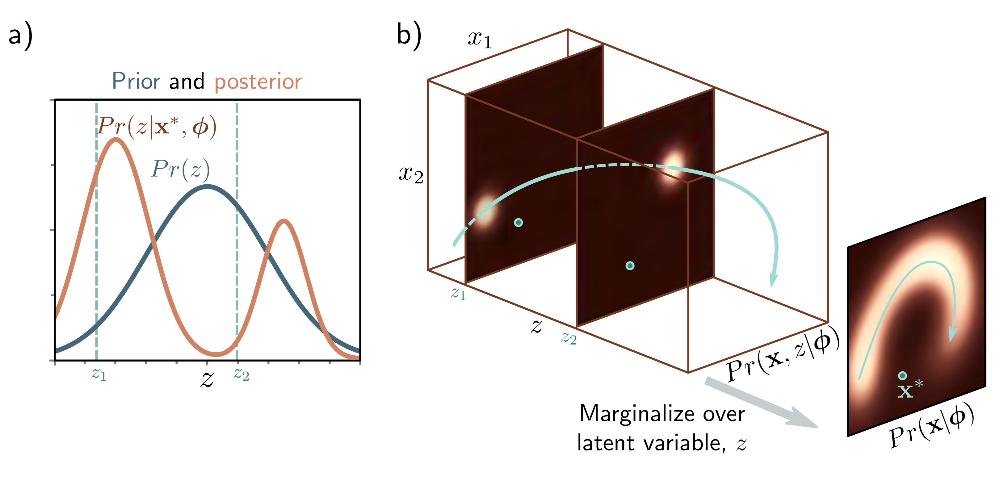

a)

  

  <strong>Figure 17.7</strong> Posterior distribution over latent variable. a) The posterior distribution $\Pr(z|x^{*},\phi)$ is the distribution over the values of the latent variable z that could be responsible for a data point $x^{*}$ . We calculate this via Bayes' rule $\Pr(z|x^{*},\phi) \propto \Pr(x^{*}|z,\phi)\Pr(z)$ . b) We compute the first term on the right-hand side (the likelihood) by assessing the probability of $x^{*}$ against the symmetric Gaussian associated with each value of z. Here, it was more likely to have been created from $z_{1}$ than $z_{2}$ . The second term is the prior probability $\Pr(z)$ over the latent variable. Combining these two factors and normalizing so the distribution sums to one gives us the posterior $\Pr(z|x^{*},\phi)$ .

## 17.4.2 ELBO as reconstruction loss minus KL distance to prior

Equations 17.16 and 17.17 are two different ways to express the ELBO. A third way is to consider the bound as reconstruction error minus the distance to the prior:

$$
\begin{aligned}
\mathrm{ELBO}[\boldsymbol{\theta},\phi]&=\int q(\mathbf{z}|\boldsymbol{\theta})\log\left[\frac{\Pr(\mathbf{x},\mathbf{z}|\phi)}{q(\mathbf{z}|\boldsymbol{\theta})}\right]d\mathbf{z}\\
&=\int q(\mathbf{z}|\boldsymbol{\theta})\log\left[\frac{\Pr(\mathbf{x}|\mathbf{z},\phi)\Pr(\mathbf{z})}{q(\mathbf{z}|\boldsymbol{\theta})}\right]d\mathbf{z}\\
&=\int q(\mathbf{z}|\boldsymbol{\theta})\log\left[\Pr(\mathbf{x}|\mathbf{z},\phi)\right]d\mathbf{z}+\int q(\mathbf{z}|\boldsymbol{\theta})\log\left[\frac{\Pr(\mathbf{z})}{q(\mathbf{z}|\boldsymbol{\theta})}\right],\qquad(17.18)\\
&=\int q(\mathbf{z}|\boldsymbol{\theta})\log\left[\Pr(\mathbf{x},\mathbf{z}|\phi)\right]d\mathbf{z}-\mathrm{D}_{KL}\left[q(\mathbf{z}|\boldsymbol{\theta})\middle|\Pr(\mathbf{z}),\right]
\end{aligned}
\qquad (17.18)
$$

where the joint distribution  $\Pr(\mathbf{x}, \mathbf{z}|\phi)$  has been factored into conditional probability  $\Pr(\mathbf{x} | \mathbf{z}, \phi)\Pr(\mathbf{z})$  between the first and second lines, and the definition of KL divergence is used again in the last line.
