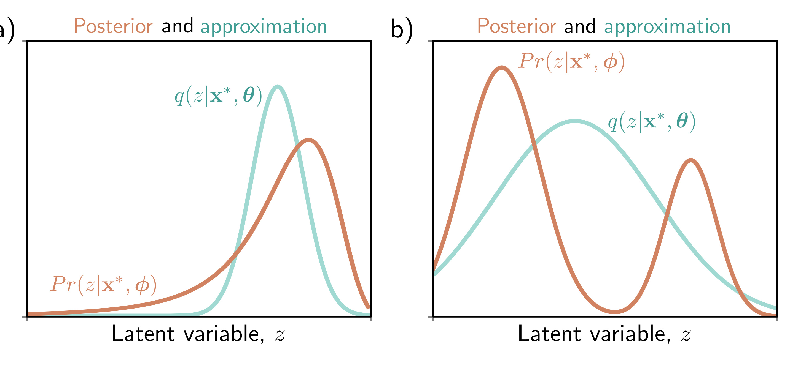

  

  <strong>Figure 17.8</strong> Variational approximation. The posterior $\Pr(\mathbf{z}|\mathbf{x}^{*}, \phi)$ can't be computed in closed form. The variational approximation chooses a family of distributions $q(\mathbf{z}|\mathbf{x}, \theta)$ (here Gaussians) and tries to find the closest member of this family to the true posterior. a) Sometimes, the approximation (cyan curve) is good and lies close to the true posterior (orange curve). b) However, if the posterior is multi-modal (as in figure 17.7), then the Gaussian approximation will be poor.

$$
\mathbb{E}_{\mathbf{z}}\big[\mathrm{a}[\mathbf{z}]]={\int}\mathrm{a}[\mathbf{z}|q(\mathbf{z}|\mathbf{x},\boldsymbol{\theta})d\mathbf{z}\approx\frac{1}{N}{\sum_{n=1}^{N}}\mathrm{a}[\mathbf{z}_{n}^{*}]
\qquad (17.22)
$$

where $\mathbf{z}_{n}^{*}$ is the $n^{th}$ sample from $q(\mathbf{z}|\mathbf{x},\boldsymbol{\theta})$. This is known as a Monte Carlo estimate. For a very approximate estimate, we can just use a single sample $\mathbf{z}^{*}$ from $q(\mathbf{z}|\mathbf{x},\boldsymbol{\theta})$:

$$
\mathrm{ELBO}[\boldsymbol{\theta},\phi]\quad\approx\quad\log\left[\Pr(\mathbf{x}|\mathbf{z}^{*},\boldsymbol{\phi})\right]-\mathrm{D}_{KL}\Big[q(\mathbf{z}|\mathbf{x},\boldsymbol{\theta})\Big|\Big|\Pr(\mathbf{z})\Big]
\qquad (17.23)
$$

The second term is the KL divergence between the variational distribution $q(\mathbf{z}|\mathbf{x},\boldsymbol{\theta})=\mathrm{Norm}_{\mathbf{Z}}[\boldsymbol{\mu},\boldsymbol{\Sigma}]$ and the prior $\Pr(\mathbf{z})=\mathrm{Norm}_{\mathbf{Z}}[\boldsymbol{0},\mathbf{I}]$. The KL divergence between two normal distributions can be calculated in closed form. For the special case where one distribution has parameters $\boldsymbol{\mu},\boldsymbol{\Sigma}$ and the other is a standard normal, it is given by:

$$
\mathrm{D}_{KL}\left[q(\mathbf{z}|\mathbf{x},\boldsymbol{\theta})\
|\Pr(\mathbf{z})\right]=\frac{1}{2}\bigg(\mathrm{Tr}[\boldsymbol{\Sigma}]+\boldsymbol{\mu}^{T}\boldsymbol{\mu}-D_{\mathbf{z}}-\log\left[\mathrm{det}[\boldsymbol{\Sigma}]\right]\bigg)
\qquad (17.24)
$$

where $D_{\mathbf{z}}$ is the dimensionality of the latent space.

## 17.6.1 VAE algorithm

To summarize, we aim to build a model that computes the evidence lower bound for a point x. Then we use an optimization algorithm to maximize this lower bound over the
