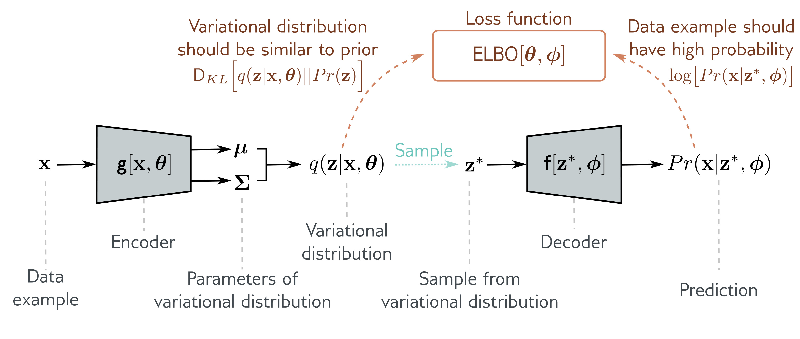

  

  <strong>Figure 17.9</strong> Variational autoencoder. The encoder $g[\mathbf{x}, \theta]$ takes a training example $\mathbf{x}$ and predicts the parameters $\mu, \Sigma$ of the variational distribution $q(\mathbf{z}|\mathbf{x}, \theta)$. We sample from this distribution and then use the decoder $f[\mathbf{z}, \phi]$ to predict the data $\mathbf{x}$. The loss function is the negative ELBO, which depends on how accurate this prediction is and how similar the variational distribution $q(\mathbf{z}|\mathbf{x}, \theta)$ is to the prior $Pr(\mathbf{z})$ (equation 17.21).

dataset and hence improve the log-likelihood. To compute the ELBO we:

• compute the mean $\mu$ and variance $\Sigma$ of the variational posterior distribution $q(\mathbf{z}|\theta, \mathbf{x})$ for this data point $\mathbf{x}$ using the network $g[\mathbf{x}, \theta]$,

• draw a sample $\mathbf{z}^{*}$ from this distribution, and

• compute the ELBO using equation 17.23.

The associated architecture is shown in figure 17.9. It should now be clear why this is called a variational autoencoder. It is variational because it computes a Gaussian approximation to the posterior distribution. It is an autoencoder because it starts with a data point $\mathbf{x}$, computes a lower-dimensional latent vector $\mathbf{z}$ from this, and then uses this vector to recreate the data point $\mathbf{x}$ as closely as possible. In this context, the mapping from the data to the latent variable by the network $g[\mathbf{x},\theta]$ is called the encoder, and the mapping from the latent variable to the data by the network $f[\mathbf{z},\phi]$ is called the decoder.

The VAE computes the ELBO as a function of both $\phi$ and $\theta$. To maximize this bound, we run mini-batches of samples through the network and update these parameters with an optimization algorithm such as SGD or Adam. The gradients of the ELBO with respect to the parameters are computed as usual using automatic differentiation. During this process, we are both moving between the colored curves (changing $\theta$) and along them (changing $\phi$) in figure 17.10. During this process, the parameters $\phi$ change to assign the data a higher likelihood in the nonlinear latent variable model.
