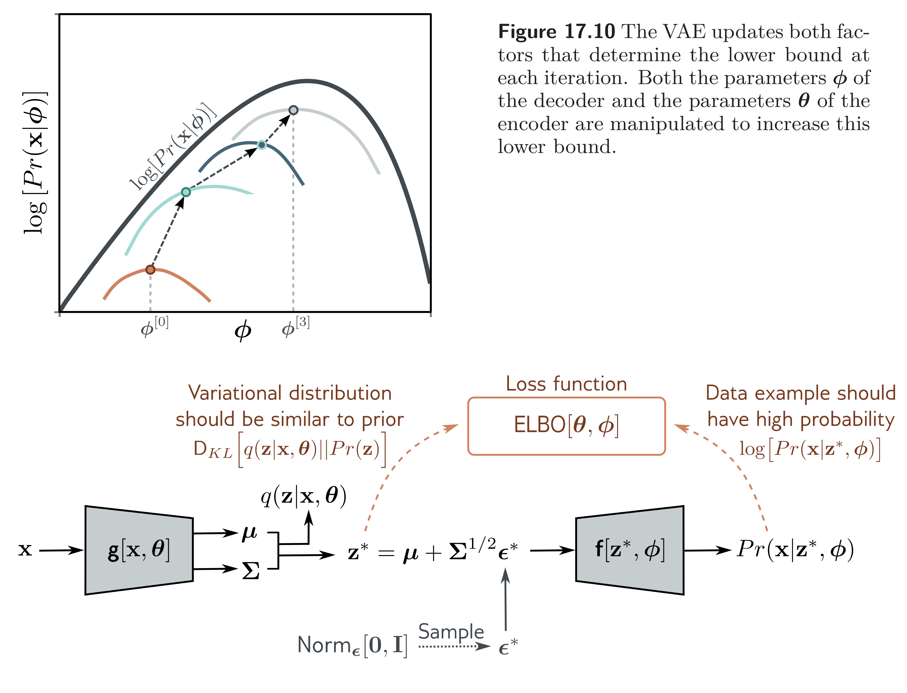

  

  <strong>Figure 17.11</strong> Reparameterization trick. With the original architecture (figure 17.9), we cannot easily backpropagate through the sampling step. The reparameterization trick removes the sampling step from the main pipeline; we draw from a standard normal and combine this with the predicted mean and covariance to get a sample from the variational distribution.

## 17.7 The reparameterization trick

There is one more complication; the network involves a sampling step, and it is difficult to differentiate through this stochastic component. However, differentiating past this step is necessary to update the parameters $\theta$ that precede it in the network.

Fortunately, there is a simple solution; we can move the stochastic part into a branch to differentiate through this stochastic component. However, differentiating past this step is necessary to update the parameters $\theta$ that precede it in the network.

to draw from the intended Gaussian. Now we can compute the derivatives as usual because the backpropagation algorithm does not need to pass down the stochastic branch. This is known as the reparameterization trick (figure 17.11). 

$$
\mathbf{z}^{*}=\boldsymbol{\mu}+\sum^{1/2}\boldsymbol{\epsilon}^{*}, \quad (17.25)
$$

 Problem 17.5

Notebook 17.2
Reparameterization trick
