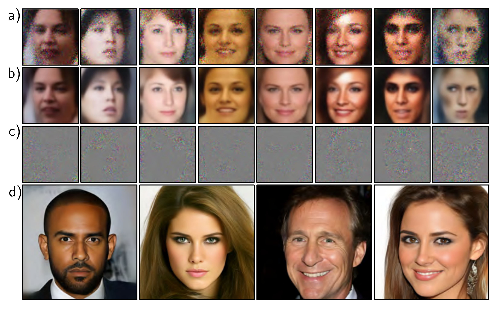

  

  <strong>Figure 17.12</strong> Sampling from a standard VAE trained on CELEBA. In each column, a latent variable $z^{*}$ is drawn and passed through the model to predict the mean $f[z^{*}, \phi]$ before adding independent Gaussian noise (see figure 17.3). a) A set of samples that are the sum of b) the predicted means and c) spherical Gaussian noise vectors. The images look too smooth before we add the noise and too noisy afterward. This is typical, and usually, the noise-free version is shown since the noise is considered to represent aspects of the image that are not modeled. Adapted from Dorta et al. (2018). d) It is now possible to generate high-quality images from VAEs using hierarchical priors, specialized architecture, and careful regularization. Adapted from Vahdat & Kautz (2020).

In this way, we can approximate the probability of new samples. With sufficient samples, this will provide a better estimate than the lower bound and could be used to evaluate the quality of the model by evaluating the log-likelihood of test data. Alternatively, it could be used as a criterion for determining whether new examples belong to the distribution or are anomalous.

## 17.8.2 Generation

VAEs build a probabilistic model, and it's easy to sample from this model by drawing from the prior $Pr(\mathbf{z})$ over the latent variable, passing this result through the decoder $f[\mathbf{z}, \phi]$ , and adding noise according to $Pr(\mathbf{x}|f[\mathbf{z}, \phi])$ . Unfortunately, samples from
