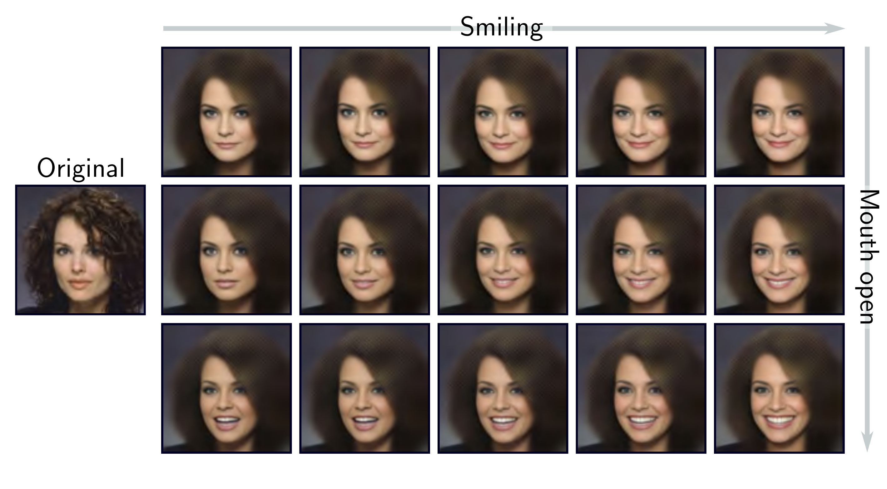

  

  <strong>Figure 17.13</strong> Resynthesis. The original image on the left is projected into the latent space using the encoder, and the mean of the predicted Gaussian is chosen to represent the image. The center-left image in the grid is the reconstruction of the input. The other images are reconstructions after manipulating the latent space in directions representing smiling/neutral (horizontal) and mouth open/closed (vertical). Adapted from White (2016).

Here the regularization term  $r\_{1}[\bullet]$  is a function of the posterior and is weighted by  $\lambda\_{1}$ . The term  $r\_{2}[{\bullet}]$  is a function of the aggregated posterior and is weighted by  $\lambda\_{2}$ .

For example, the beta VAE upweights the second term in the ELBO (equation 17.18):

$$
\mathrm{ELBO}[\boldsymbol{\theta},\phi]\quad\approx\quad\log\left[\Pr(\mathbf{x}|\mathbf{z}^{*},\boldsymbol{\phi})\right]-\beta\cdot\mathrm{D}_{KL}\left[q(\mathbf{z}|\mathbf{x},\boldsymbol{\theta})\middle|\Pr(\mathbf{z})\right]
\qquad (17.30)
$$

where  $\beta > 1$  determines how much more the deviation from the prior  $\Pr(\mathbf{z})$  is weighted relative to the reconstruction error. Since the prior is usually a multivariate normal with a spherical covariance matrix, its dimensions are independent. Hence, up-weighting this term encourages the posterior distributions to be less correlated. Another variant is the total correlation VAE, which adds a term to decrease the total correlation between variables in the latent space (figure 17.14) and maximizes the mutual information between a small subset of the latent variables and the observations.

## 17.9 Summary

The VAE is an architecture that helps to learn a nonlinear latent variable model over x. This model can generate new examples by sampling from the latent variable, passing the result through a deep network, and then adding independent Gaussian noise.
