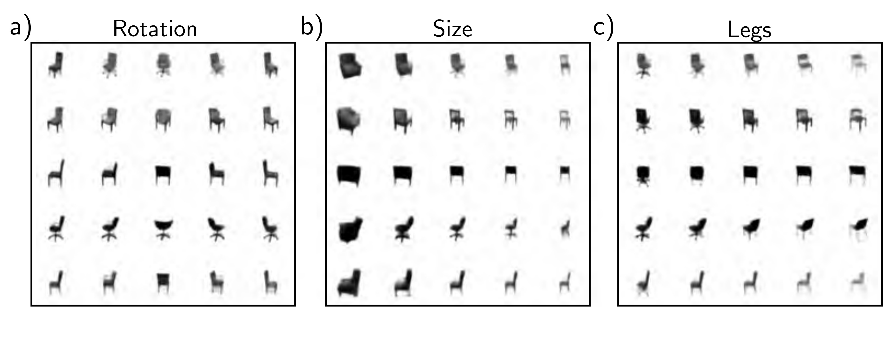

  

  <strong>Figure 17.14</strong> Disentanglement in the total correlation VAE. The VAE model is modified so that the loss function encourages the total correlation of the latent variables to be minimized and hence encourages disentanglement. When trained on a dataset of images of chairs, several of the latent dimensions have clear real-world interpretations, including a) rotation, b) overall size, and c) legs (swivel chair versus normal). In each case, the central column depicts samples from the model, and as we move left to right, we are subtracting or adding a coordinate vector in latent space. Adapted from Chen et al. (2018d).

It is not possible to compute the likelihood of a data point in closed form, and this poses problems for training with maximum likelihood. However, we can define a lower bound on the likelihood and maximize this bound. Unfortunately, for the bound to be tight, we need to compute the posterior probability of the latent variable given the observed data, which is also intractable. The solution is to make a variational approximation. This is a simpler distribution (usually a Gaussian) that approximates the posterior and whose parameters are computed by a second encoder network.

To create high-quality samples from the VAE, it seems to be necessary to model the latent space with more sophisticated probability distributions than the Gaussian prior and posterior. One option is to use hierarchical priors (in which one latent variable generates another). The next chapter discusses diffusion models, which produce very high-quality examples and can be viewed as hierarchical VAEs.

## Notes

The VAE was originally introduced by Kingma & Welling (2014). A comprehensive introduction to variational autoencoders can be found in Kingma et al. (2019).

Applications: The VAE and variants thereof have been applied to images (Kingma & Welling, 2014; Gregor et al., 2016; Gulrajani et al., 2016; Akuzawa et al., 2018), speech (Hsu et al., 2017b), text (Bowman et al., 2015; Hu et al., 2017; Xu et al., 2020), molecules (Gómez-Bombarelli et al.,
