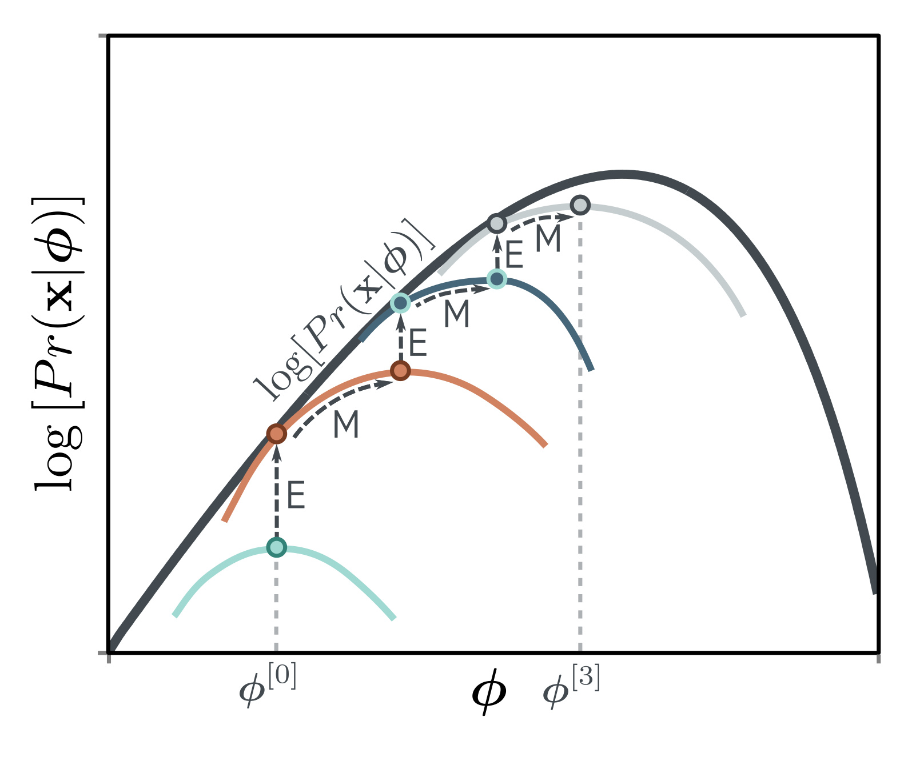

  

  <strong>Figure 17.15</strong> Expectation maximization (EM) algorithm. The EM algorithm alternately adjusts the auxiliary parameters $\theta$ (moves between colored curves) and model parameters $\phi$ (moves along colored curves) until the maximum is reached. These adjustments are known as the E-step and M-step, respectively. Because the E-Step uses the posterior distribution $\Pr(h|\mathbf{x}, \phi)$ for $q(h|\mathbf{x}, \theta)$ , the bound is tight, and the colored curve touches the black likelihood curve after each E-Step.

(2018). Chen et al. (2018d) further decomposed the ELBO to show the existence of a term measuring the total correlation between the latent variables (i.e., the distance between the aggregate posterior and the product of its marginals). They use this to motivate the total correlation VAE, which attempts to minimize this quantity. The Factor VAE (Kim & Mnih, 2018) uses a different approach to minimize the total correlation. Mathieu et al. (2019) discuss the factors that are important in disentangling representations.

Reparameterization trick: Consider computing an expectation of some function, where the probability distribution with which the expectation is taken depends on some parameters. The reparameterization trick computes the derivative of this expectation with respect to these parameters. This chapter introduced this as a method to differentiate through the sampling procedure approximating the expectation; there are alternative approaches (see problem 17.5), but the reparameterization trick gives an estimator that (usually) has low variance. This issue is discussed in Rezende et al. (2014), Kingma et al. (2015), and Roeder et al. (2017).

Lower bound and the EM algorithm: VAE training is based on optimizing the evidence lower bound (sometimes also referred to as the ELBO, variational lower bound, or negative variational free energy). Hoffman & Johnson (2016) and Lücke et al. (2020) re-express this lower bound in several ways that elucidate its properties. Other work has aimed to make this bound tighter (Burda et al., 2016; Li & Turner, 2016; Borshchein et al., 2019). For example, Burda et al. (2016) use a modified bound based on using multiple importance-weighted samples from the approximate posterior to form the objective function.

The ELBO is tight when the distribution  $q(\mathbf{z}|\boldsymbol{\theta})$  matches the posterior  $\Pr(\mathbf{z}|\mathbf{x},\phi)$ . This is the basis of the expectation maximization (EM) algorithm (Dempster et al., 1977). Here, we alternately (i) choose  $\theta$  so that  $q(\mathbf{z}|\boldsymbol{\theta})$  equals the posterior  $\Pr(\mathbf{z}|\mathbf{x},\phi)$  and (ii) change  $\phi$  to maximize the lower bound (figure 17.15). This is viable for models like the mixture of Gaussians, where we can compute the posterior distribution in closed form. Unfortunately, this is not the case for the nonlinear latent variable model, so this method cannot be used.

## Problems

Problem 17.1 How many parameters are needed to create a 1D mixture of Gaussians with n = 5
