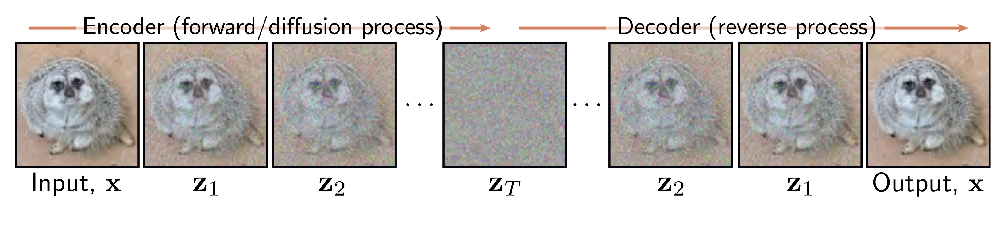

  

  <strong>Figure 18.1</strong> Diffusion models. The encoder (forward, or diffusion process) maps the input x through a series of latent variables $z_{1}$ $\ldots$ $z_{T}$ . This process is pre-specified and gradually mixes the data with noise until only noise remains. The decoder (reverse process) is learned and passes the data back through the latent variables, removing noise at each stage. After training, new examples are generated by sampling noise vectors $z_{T}$ and passing them through the decoder.

adjacent pair of latent variables  $z_{t}$  and  $z_{t-1}$ . The loss function encourages each network to invert the corresponding encoder step. The result is that noise is gradually removed from the representation until a realistic-looking data example remains. To generate a new data example x, we draw a sample from  $q(\mathbf{z}_{T})$  and pass it through the decoder.

In section 18.2, we consider the encoder in detail. Its properties are non-obvious but are critical for the learning algorithm. In section 18.3, we discuss the decoder. Section 18.4 derives the training algorithm, and section 18.5 reformulates it to be more practical. Section 18.6 discusses implementation details, including how to make the generation conditional on text prompts.

## 18.2 Encoder (forward process)

The diffusion or forward process [^1]  (figure 18.2) maps a data example x through a series of intermediate variables  $z_{1}, z_{2}, \ldots, z_{T}$  with the same size as x according to:

$$
\begin{aligned}
\mathbf{z}_{1}&=\sqrt{1-\beta_{1}}\cdot\mathbf{x}+\sqrt{\beta_{1}}\cdot\boldsymbol{\epsilon}_{1}\\
\mathbf{z}_{t}&=\sqrt{1-\beta_{t}}\cdot\mathbf{z}_{t-1}+\sqrt{\beta_{t}}\cdot\boldsymbol{\epsilon}_{t}\quad\forall t\in\lbrace 2,\ldots,T\rbrace
\end{aligned}
\qquad (18.1)
$$

where  $\epsilon_{t}$  is noise drawn from a standard normal distribution. The first term attenuates the data plus any noise added so far, and the second adds more noise. The hyperparameters  $\beta_{t} \in [0,1]$  determine how quickly the noise is blended and are collectively known as the noise schedule. The forward process can equivalently be written as:
