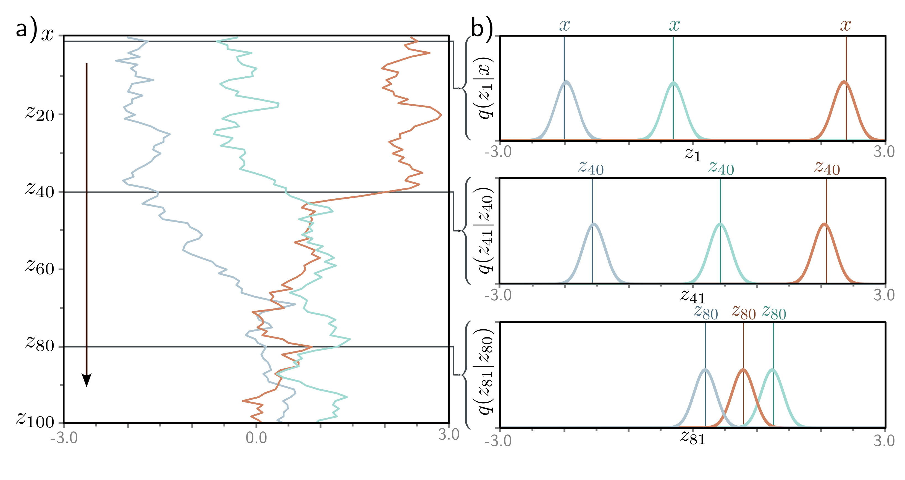

  

  <strong>Figure 18.2</strong> Forward process. a) We consider one-dimensional data x with T = 100 latent variables $z_{1}, \ldots, z_{100}$ and $\beta = 0.03$ at all steps. Three values of x (gray, cyan, and orange) are initialized (top row). These are propagated through $z_{1}, \ldots, z_{100}$ . At each step, the variable is updated by attenuating its value by $\sqrt{1 - \beta}$ and adding noise with mean zero and variance $\beta$ (equation 18.1). Accordingly, the three examples noisily propagate through the variables with a tendency to move toward zero. b) The conditional probabilities $\Pr(z_{1}|x)$ and $\Pr(z_{t}|z_{t-1})$ are normal distributions with a mean that is slightly closer to zero than the current point and a fixed variance $\beta_{t}$ (equation 18.2).

(18.2)

$$
\begin{aligned}
q(\mathbf{z}_{1}|\mathbf{x})&={\mathrm{Norm}_{\mathbf{z}_{1}}\left[\sqrt{1-\beta_{1}\mathbf{x}},\beta_{1}\mathbf{I}\right]}\\
q(\mathbf{z}_{t}|\mathbf{z}_{t-1})&={\mathrm{Norm}_{\mathbf{z}_{t}}\left[\sqrt{1-\beta_{t}\mathbf{z}_{t-1}},\beta_{t}\mathbf{I}\right]}&{\quad\forall t\in\lbrace 2,\ldots,T\rbrace .
\end{aligned}
$$

This is a Markov chain because the probability of $\mathbf{z}_{t}$ is determined entirely by the value of the immediately preceding variable $\mathbf{z}_{t-1}$. With sufficient steps $T$, all traces of the original data are removed, and $q(\mathbf{z}_{T}|\mathbf{x}) = q(\mathbf{z}_{T})$ becomes a standard normal distribution.[^2]

The joint distribution of all the latent variables $\mathbf{z}_{1}, \mathbf{z}_{2}, \ldots, \mathbf{z}_{T}$ given input $\mathbf{x}$ is:

(18.3)

$$
q(\mathbf{z}_{1}..T|\mathbf{x})=q(\mathbf{z}_{1}|\mathbf{x})\prod_{t=2}^{T}q(\mathbf{z}_{t}|\mathbf{z}_{t-1}).
$$
[^2]: We use  $q(\mathbf{z}_{t}|\mathbf{z}_{t-1})$  rather than  $\Pr(\mathbf{z}_{t}|\mathbf{z}_{t-1})$  to match the notation in the description of the VAE encoder in the previous chapter.
